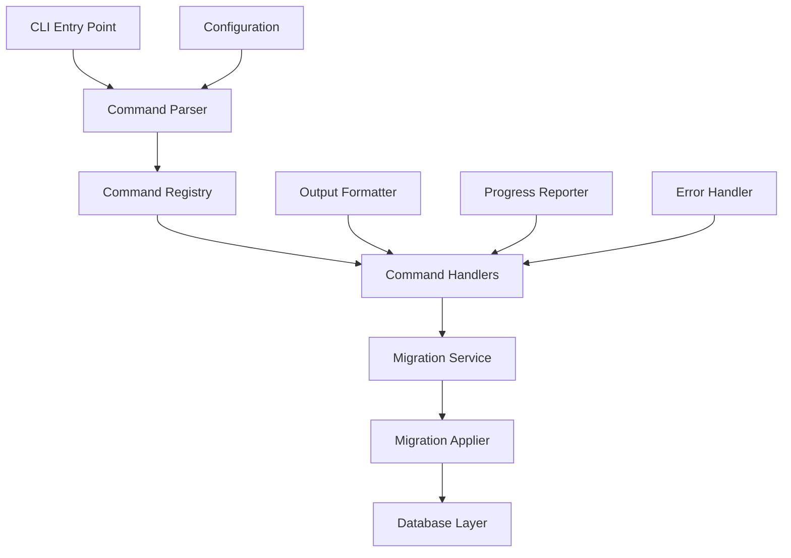

# SODAF CLI Commands Architecture Design

## Overview

This document outlines the comprehensive architecture for implementing CLI Commands (P2-017) in the SODAF framework. The CLI system will provide migration management capabilities through command-line interface, integrating with the existing migration system.

## Task Requirements Analysis

Based on P2-017 from the backlog, the CLI must support:

1. **Core Migration Commands:**
   - `sodaf migrate` - Run all pending migrations
   - `sodaf migrate:dry-run` - Show SQL without executing
   - `sodaf migrate:status` - Show pending migrations
   - `sodaf migrate:rollback` - Revert last migration

2. **Advanced Features:**
   - Site-specific operations (`--site=mysite`)
   - Granular rollback control (`--steps=3`, `--id=xxx`)
   - Force execution (`--force`)
   - Verbose output (`--verbose`)
   - Proper exit codes (0 for success, 1 for failure)
   - Progress output and warnings

## Architecture Design

### 1. CLI Architecture Overview



### 2. Core Components

#### 2.1. CLI Entry Point (`src/cli/index.ts`)
- Main executable entry point
- Argument parsing and validation
- Command routing
- Global error handling
- Exit code management

#### 2.2. Command System (`src/cli/commands/`)
- Base command interface and abstract class
- Command registry for registration and discovery
- Individual command implementations
- Command middleware system

#### 2.3. Migration Service (`src/cli/services/migration-service.ts`)
- High-level migration operations
- Integration with existing MigrationApplier
- Site management and context handling
- Operation orchestration

#### 2.4. Configuration System (`src/cli/config/`)
- CLI configuration management
- Site configuration loading
- Default values and environment variables
- Configuration validation

#### 2.5. Output System (`src/cli/output/`)
- Formatted output generation
- Progress reporting
- Table formatting for status commands
- Color and styling support

### 3. Command Structure Design

#### 3.1. Command Hierarchy
```
sodaf
├── migrate
│   ├── (default) - Run all pending migrations
│   ├── dry-run - Show SQL without executing
│   ├── status - Show migration status
│   └── rollback - Revert migrations
│       ├── (default) - Revert last migration
│       ├── --steps=N - Revert last N migrations
│       └── --id=XXX - Revert specific migration
└── [future commands]
```

#### 3.2. Command Interface
```typescript
interface Command {
	name: string;
	description: string;
	usage: string;
	examples: string[];
	options: CommandOption[];
	execute(args: CommandArgs, context: ExecutionContext): Promise<number>;
}
```

### 4. File Structure

```
src/
├── cli/
│   ├── index.ts                    # Main CLI entry point
│   ├── types.ts                    # CLI-specific types
│   ├── commands/
│   │   ├── index.ts               # Command registry
│   │   ├── base-command.ts        # Base command class
│   │   ├── migrate/
│   │   │   ├── index.ts           # Migrate command exports
│   │   │   ├── migrate.ts         # Main migrate command
│   │   │   ├── dry-run.ts         # Dry-run command
│   │   │   ├── status.ts          # Status command
│   │   │   └── rollback.ts        # Rollback command
│   │   └── [future commands]
│   ├── services/
│   │   ├── index.ts               # Service exports
│   │   ├── migration-service.ts   # Migration operations
│   │   ├── site-service.ts        # Site management
│   │   └── config-service.ts      # Configuration management
│   ├── config/
│   │   ├── index.ts               # Config exports
│   │   ├── cli-config.ts          # CLI configuration
│   │   ├── site-config.ts         # Site configuration
│   │   └── defaults.ts            # Default values
│   ├── output/
│   │   ├── index.ts               # Output exports
│   │   ├── formatter.ts           # Output formatting
│   │   ├── progress.ts            # Progress reporting
│   │   └── colors.ts              # Color utilities
│   └── utils/
│       ├── index.ts               # Utility exports
│       ├── args-parser.ts         # Argument parsing
│       ├── error-handler.ts       # Error handling
│       └── logger.ts              # Logging utilities
└── [existing files]
```

### 5. Integration with Migration System

#### 5.1. Migration Service Integration
The CLI will integrate with the existing migration system through the `MigrationApplier` class:

```typescript
class MigrationService {
	private applier: MigrationApplier;
	private siteService: SiteService;
	
	async runMigrations(options: MigrationOptions): Promise<MigrationResult> {
		// Set up site context
		const context = await this.siteService.getSiteContext(options.site);
		
		// Apply migrations using existing MigrationApplier
		return await this.applier.syncAllDocTypes({
			...options,
			context
		});
	}
	
	async rollbackMigrations(options: RollbackOptions): Promise<MigrationResult> {
		// Implementation for rollback operations
	}
}
```

#### 5.2. Site Management
The CLI will support multi-site deployments:

```typescript
interface SiteConfig {
	name: string;
	databasePath: string;
	configPath: string;
	active: boolean;
}

class SiteService {
	async getSiteContext(siteName?: string): Promise<SiteContext> {
		// Load site-specific configuration
		// Initialize database connection
		// Return execution context
	}
	
	async listSites(): Promise<SiteConfig[]> {
		// List all configured sites
	}
}
```

### 6. Output and Progress Reporting

#### 6.1. Output Formatting
```typescript
interface OutputFormatter {
	formatMigrationStatus(status: MigrationStatus): string;
	formatMigrationResult(result: MigrationResult): string;
	formatError(error: Error): string;
	formatTable(data: any[], headers: string[]): string;
}
```

#### 6.2. Progress Reporting
```typescript
interface ProgressReporter {
	startOperation(operation: string, total?: number): void;
	updateProgress(current: number, message?: string): void;
	completeOperation(message?: string): void;
	reportWarning(warning: string): void;
	reportError(error: string): void;
}
```

### 7. Error Handling Strategy

#### 7.1. Error Categories
- **Configuration Errors**: Invalid CLI configuration
- **Site Errors**: Site not found, database connection issues
- **Migration Errors**: Migration failures, validation errors
- **System Errors**: File system errors, permission issues

#### 7.2. Error Handling Flow
```typescript
class ErrorHandler {
	handle(error: Error, context: ExecutionContext): number {
		// Categorize error
		const category = this.categorizeError(error);
		
		// Log error details
		this.logError(error, context);
		
		// Format user-friendly message
		const message = this.formatErrorMessage(error, category);
		
		// Output to user
		context.output.error(message);
		
		// Return appropriate exit code
		return this.getExitCode(category);
	}
}
```

### 8. Configuration Management

#### 8.1. CLI Configuration
```typescript
interface CLIConfig {
	defaultSite?: string;
	verbose: boolean;
	force: boolean;
	timeout: number;
	backup: boolean;
	outputFormat: 'text' | 'json' | 'table';
	colors: boolean;
}
```

#### 8.2. Configuration Sources (in order of precedence)
1. Command-line arguments
2. Environment variables
3. Site-specific configuration
4. Global CLI configuration
5. Default values

### 9. Command Implementation Details

#### 9.1. Migrate Command
```typescript
class MigrateCommand extends BaseCommand {
	async execute(args: CommandArgs, context: ExecutionContext): Promise<number> {
		const options = this.parseOptions(args);
		const service = new MigrationService();
		
		try {
			const result = await service.runMigrations(options);
			this.outputResult(result, context);
			return 0; // Success
		} catch (error) {
			return context.errorHandler.handle(error, context);
		}
	}
	
	private parseOptions(args: CommandArgs): MigrationOptions {
		return {
			site: args.getOption('site'),
			dryRun: args.hasFlag('dry-run'),
			force: args.hasFlag('force'),
			verbose: args.hasFlag('verbose'),
			// ... other options
		};
	}
}
```

#### 9.2. Status Command
```typescript
class StatusCommand extends BaseCommand {
	async execute(args: CommandArgs, context: ExecutionContext): Promise<number> {
		const service = new MigrationService();
		const siteName = args.getOption('site');
		
		try {
			const status = await service.getMigrationStatus(siteName);
			this.displayStatusTable(status, context);
			return 0;
		} catch (error) {
			return context.errorHandler.handle(error, context);
		}
	}
	
	private displayStatusTable(status: MigrationStatus, context: ExecutionContext): void {
		const table = [
			['DocType', 'Status', 'Last Migration', 'Pending'],
			...status.doctypes.map(dt => [
				dt.name,
				dt.status,
				dt.lastMigration || 'Never',
				dt.pendingCount.toString()
			])
		];
		
		context.output.table(table);
	}
}
```

### 10. Package.json Integration

The CLI will be integrated into the existing package.json:

```json
{
	"bin": {
		"sodaf": "./dist/cli/index.js"
	},
	"scripts": {
		"build:cli": "tsc -p tsconfig.cli.json",
		"cli": "node dist/cli/index.js"
	}
}
```

### 11. Testing Strategy

#### 11.1. Unit Tests
- Command parsing and validation
- Service layer functionality
- Configuration management
- Output formatting

#### 11.2. Integration Tests
- End-to-end command execution
- Migration system integration
- Error handling flows
- Multi-site operations

#### 11.3. Test Structure
```
src/cli/__tests__/
├── commands/
│   ├── migrate.test.ts
│   ├── status.test.ts
│   └── rollback.test.ts
├── services/
│   ├── migration-service.test.ts
│   └── site-service.test.ts
└── integration/
    ├── end-to-end.test.ts
    └── multi-site.test.ts
```

## Implementation Priority

1. **Phase 1: Core Infrastructure**
   - Basic CLI structure and entry point
   - Command parsing and routing
   - Error handling framework
   - Basic output formatting

2. **Phase 2: Migration Commands**
   - Migrate command implementation
   - Status command implementation
   - Integration with MigrationApplier
   - Basic site support

3. **Phase 3: Advanced Features**
   - Rollback command implementation
   - Dry-run functionality
   - Advanced site management
   - Progress reporting and warnings

4. **Phase 4: Polish and Testing**
   - Comprehensive error handling
   - Output formatting improvements
   - Performance optimization
   - Complete test coverage

## Conclusion

This architecture provides a solid foundation for implementing the CLI Commands feature in SODAF. It leverages the existing migration system while providing a clean, extensible command-line interface that can grow with the framework's needs.

The modular design ensures that each component has a single responsibility, making the system maintainable and testable. The integration points with the migration system are well-defined, ensuring that the CLI can leverage all existing functionality while providing a user-friendly interface.