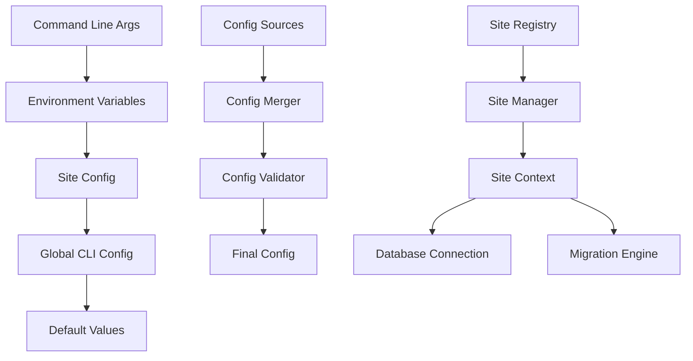

# CLI Configuration and Site Management

This document outlines the design for configuration management and multi-site support in SODAF CLI system.

## Configuration System Architecture

### Configuration Hierarchy



### Configuration Service Implementation

```typescript
// src/cli/services/config-service.ts
export class ConfigService {
	private configPath: string;
	private sitesDir: string;
	private globalConfig: CLIConfig | null = null;
	private siteConfigs: Map<string, SiteConfig> = new Map();
	private configSchema: any;
	
	constructor() {
		this.configPath = this.getConfigPath();
		this.sitesDir = this.getSitesDir();
		this.configSchema = this.loadConfigSchema();
	}
	
	/**
	 * Load global CLI configuration
	 */
	async loadConfig(): Promise<CLIConfig> {
		if (this.globalConfig) {
			return this.globalConfig;
		}
		
		try {
			// Load from file
			const configData = await this.loadConfigFile(this.configPath);
			
			// Apply environment variables
			const envConfig = this.loadEnvironmentConfig();
			const mergedConfig = this.mergeConfigs(configData, envConfig);
			
			// Validate configuration
			const validation = await this.validateConfig(mergedConfig);
			if (!validation.valid) {
				throw new CLIError(
					`Invalid configuration: ${validation.errors.join(', ')}`,
					'INVALID_CONFIG',
					'configuration'
				);
			}
			
			// Apply defaults
			this.globalConfig = this.applyDefaults(mergedConfig);
			
			return this.globalConfig;
			
		} catch (error) {
			// Return default config on error
			this.globalConfig = this.getDefaultConfig();
			return this.globalConfig;
		}
	}
	
	/**
	 * Save global CLI configuration
	 */
	async saveConfig(config: CLIConfig): Promise<void> {
		try {
			// Validate before saving
			const validation = await this.validateConfig(config);
			if (!validation.valid) {
				throw new CLIError(
					`Cannot save invalid configuration: ${validation.errors.join(', ')}`,
					'INVALID_CONFIG',
					'configuration'
				);
			}
			
			// Ensure config directory exists
			await this.ensureConfigDirectory();
			
			// Save to file
			const configData = JSON.stringify(config, null, 2);
			await fs.writeFile(this.configPath, configData, 'utf-8');
			
			// Update cache
			this.globalConfig = config;
			
		} catch (error) {
			throw new CLIError(
				`Failed to save configuration: ${error.message}`,
				'CONFIG_SAVE_ERROR',
				'filesystem'
			);
		}
	}
	
	/**
	 * Get configuration value by key
	 */
	get<T>(key: string, defaultValue?: T): T {
		if (!this.globalConfig) {
			throw new Error('Configuration not loaded');
		}
		
		return this.getNestedValue(this.globalConfig, key, defaultValue);
	}
	
	/**
	 * Set configuration value by key
	 */
	async set(key: string, value: any): Promise<void> {
		if (!this.globalConfig) {
			await this.loadConfig();
		}
		
		this.setNestedValue(this.globalConfig, key, value);
		await this.saveConfig(this.globalConfig);
	}
	
	/**
	 * Get all available sites
	 */
	async getSites(): Promise<SiteConfig[]> {
		const sites: SiteConfig[] = [];
		
		try {
			const siteNames = await this.getSiteNames();
			
			for (const siteName of siteNames) {
				const siteConfig = await this.loadSiteConfig(siteName);
				if (siteConfig) {
					sites.push(siteConfig);
				}
			}
			
			return sites;
			
		} catch (error) {
			throw new CLIError(
				`Failed to load sites: ${error.message}`,
				'SITES_LOAD_ERROR',
				'filesystem'
			);
		}
	}
	
	/**
	 * Get site configuration by name
	 */
	async getSite(siteName: string): Promise<SiteConfig | null> {
		// Check cache first
		if (this.siteConfigs.has(siteName)) {
			return this.siteConfigs.get(siteName)!;
		}
		
		// Load from file
		const siteConfig = await this.loadSiteConfig(siteName);
		if (siteConfig) {
			this.siteConfigs.set(siteName, siteConfig);
		}
		
		return siteConfig;
	}
	
	/**
	 * Save site configuration
	 */
	async saveSite(siteConfig: SiteConfig): Promise<void> {
		try {
			// Validate site configuration
			const validation = await this.validateSiteConfig(siteConfig);
			if (!validation.valid) {
				throw new CLIError(
					`Invalid site configuration: ${validation.errors.join(', ')}`,
					'INVALID_SITE_CONFIG',
					'configuration'
				);
			}
			
			// Ensure site directory exists
			const siteDir = path.join(this.sitesDir, siteConfig.name);
			await fs.mkdir(siteDir, { recursive: true });
			
			// Save site configuration
			const siteConfigPath = path.join(siteDir, 'site.json');
			const configData = JSON.stringify(siteConfig, null, 2);
			await fs.writeFile(siteConfigPath, configData, 'utf-8');
			
			// Update cache
			this.siteConfigs.set(siteConfig.name, siteConfig);
			
		} catch (error) {
			throw new CLIError(
				`Failed to save site configuration: ${error.message}`,
				'SITE_SAVE_ERROR',
				'filesystem'
			);
		}
	}
	
	private getConfigPath(): string {
		// Check environment variable first
		if (process.env.SODAF_CONFIG) {
			return process.env.SODAF_CONFIG;
		}
		
		// Check user config directory
		const homeDir = os.homedir();
		const userConfigDir = path.join(homeDir, '.sodaf');
		
		return path.join(userConfigDir, 'cli.json');
	}
	
	private getSitesDir(): string {
		// Check environment variable first
		if (process.env.SODAF_SITES_DIR) {
			return process.env.SODAF_SITES_DIR;
		}
		
		// Use user config directory
		const homeDir = os.homedir();
		return path.join(homeDir, '.sodaf', 'sites');
	}
	
	private async loadConfigFile(configPath: string): Promise<Partial<CLIConfig>> {
		try {
			const configData = await fs.readFile(configPath, 'utf-8');
			return JSON.parse(configData);
		} catch (error) {
			if (error.code === 'ENOENT') {
				return {}; // File doesn't exist
			}
			throw error;
		}
	}
	
	private loadEnvironmentConfig(): Partial<CLIConfig> {
		const envConfig: Partial<CLIConfig> = {};
		
		// Map environment variables to config keys
		const envMappings: Record<string, string> = {
			'SODAF_DEFAULT_SITE': 'defaultSite',
			'SODAF_OUTPUT_FORMAT': 'outputFormat',
			'SODAF_COLORS': 'colors',
			'SODAF_TIMEOUT': 'timeout',
			'SODAF_BATCH_SIZE': 'batchSize',
			'SODAF_BACKUP': 'backup',
			'SODAF_VERBOSE': 'verbose',
			'SODAF_FORCE': 'force',
			'SODAF_LOG_LEVEL': 'logLevel'
		};
		
		for (const [envVar, configKey] of Object.entries(envMappings)) {
			const value = process.env[envVar];
			if (value !== undefined) {
				// Convert string values to appropriate types
				envConfig[configKey] = this.parseEnvironmentValue(value, configKey);
			}
		}
		
		return envConfig;
	}
	
	private parseEnvironmentValue(value: string, key: string): any {
		// Boolean values
		if (['colors', 'backup', 'verbose', 'force'].includes(key)) {
			return value.toLowerCase() === 'true' || value === '1';
		}
		
		// Numeric values
		if (['timeout', 'batchSize'].includes(key)) {
			return parseInt(value, 10);
		}
		
		// String values
		return value;
	}
	
	private mergeConfigs(...configs: Partial<CLIConfig>[]): CLIConfig {
		const merged: CLIConfig = {} as CLIConfig;
		
		for (const config of configs) {
			Object.assign(merged, config);
		}
		
		return merged;
	}
	
	private applyDefaults(config: Partial<CLIConfig>): CLIConfig {
		const defaults = this.getDefaultConfig();
		return this.mergeConfigs(defaults, config);
	}
	
	private getDefaultConfig(): CLIConfig {
		return {
			defaultSite: 'default',
			outputFormat: 'text',
			colors: true,
			timeout: 300,
			batchSize: 1000,
			backup: true,
			verbose: false,
			force: false,
			logLevel: 'info',
			sitesDir: this.getSitesDir(),
			configPath: this.getConfigPath()
		};
	}
	
	private async validateConfig(config: CLIConfig): Promise<ValidationResult> {
		const errors: string[] = [];
		const warnings: string[] = [];
		
		// Validate output format
		const validFormats = ['text', 'json', 'table'];
		if (!validFormats.includes(config.outputFormat)) {
			errors.push(`Invalid output format: ${config.outputFormat}`);
		}
		
		// Validate log level
		const validLogLevels = ['error', 'warn', 'info', 'debug'];
		if (!validLogLevels.includes(config.logLevel)) {
			errors.push(`Invalid log level: ${config.logLevel}`);
		}
		
		// Validate numeric values
		if (config.timeout <= 0) {
			errors.push('Timeout must be positive');
		}
		
		if (config.batchSize <= 0) {
			errors.push('Batch size must be positive');
		}
		
		return {
			valid: errors.length === 0,
			errors,
			warnings,
			recommendations: []
		};
	}
	
	private async getSiteNames(): Promise<string[]> {
		try {
			const entries = await fs.readdir(this.sitesDir, { withFileTypes: true });
			return entries
				.filter(entry => entry.isDirectory())
				.map(entry => entry.name);
		} catch (error) {
			if (error.code === 'ENOENT') {
				return []; // Sites directory doesn't exist
			}
			throw error;
		}
	}
	
	private async loadSiteConfig(siteName: string): Promise<SiteConfig | null> {
		try {
			const siteConfigPath = path.join(this.sitesDir, siteName, 'site.json');
			const configData = await fs.readFile(siteConfigPath, 'utf-8');
			const config = JSON.parse(configData);
			
			// Validate site configuration
			const validation = await this.validateSiteConfig(config);
			if (!validation.valid) {
				throw new CLIError(
					`Invalid site configuration for '${siteName}': ${validation.errors.join(', ')}`,
					'INVALID_SITE_CONFIG',
					'configuration'
				);
			}
			
			return config;
			
		} catch (error) {
			if (error.code === 'ENOENT') {
				return null; // Site doesn't exist
			}
			throw error;
		}
	}
	
	private async validateSiteConfig(config: SiteConfig): Promise<ValidationResult> {
		const errors: string[] = [];
		const warnings: string[] = [];
		
		// Required fields
		if (!config.name) {
			errors.push('Site name is required');
		}
		
		if (!config.database) {
			errors.push('Database configuration is required');
		} else {
			if (!config.database.type) {
				errors.push('Database type is required');
			}
			
			if (!config.database.path) {
				errors.push('Database path is required');
			}
		}
		
		// Validate database path
		if (config.database?.path) {
			const dbPath = path.resolve(config.database.path);
			const dbDir = path.dirname(dbPath);
			
			// Check if directory exists
			if (!await fs.pathExists(dbDir)) {
				warnings.push(`Database directory does not exist: ${dbDir}`);
			}
		}
		
		return {
			valid: errors.length === 0,
			errors,
			warnings,
			recommendations: []
		};
	}
	
	private async ensureConfigDirectory(): Promise<void> {
		const configDir = path.dirname(this.configPath);
		await fs.mkdir(configDir, { recursive: true });
	}
	
	private getNestedValue(obj: any, path: string, defaultValue?: any): any {
		const keys = path.split('.');
		let current = obj;
		
		for (const key of keys) {
			if (current === null || current === undefined) {
				return defaultValue;
			}
			current = current[key];
		}
		
		return current !== undefined ? current : defaultValue;
	}
	
	private setNestedValue(obj: any, path: string, value: any): void {
		const keys = path.split('.');
		let current = obj;
		
		for (let i = 0; i < keys.length - 1; i++) {
			const key = keys[i];
			if (!(key in current)) {
				current[key] = {};
			}
			current = current[key];
		}
		
		current[keys[keys.length - 1]] = value;
	}
	
	private loadConfigSchema(): any {
		// Load JSON schema for configuration validation
		return {
			type: 'object',
			properties: {
				defaultSite: { type: 'string' },
				outputFormat: { 
					type: 'string', 
					enum: ['text', 'json', 'table'] 
				},
				colors: { type: 'boolean' },
				timeout: { type: 'number', minimum: 1 },
				batchSize: { type: 'number', minimum: 1 },
				backup: { type: 'boolean' },
				verbose: { type: 'boolean' },
				force: { type: 'boolean' },
				logLevel: { 
					type: 'string', 
					enum: ['error', 'warn', 'info', 'debug'] 
				}
			},
			required: []
		};
	}
}
```

### Site Service Implementation

```typescript
// src/cli/services/site-service.ts
export class SiteService {
	private configService: ConfigService;
	private logger: Logger;
	private siteContexts: Map<string, SiteContext> = new Map();
	
	constructor(configService: ConfigService, logger: Logger) {
		this.configService = configService;
		this.logger = logger;
	}
	
	/**
	 * Get all available sites
	 */
	async getAllSites(): Promise<SiteConfig[]> {
		return await this.configService.getSites();
	}
	
	/**
	 * Get site by name
	 */
	async getSite(siteName: string): Promise<SiteConfig | null> {
		return await this.configService.getSite(siteName);
	}
	
	/**
	 * Get default site
	 */
	async getDefaultSite(): Promise<SiteConfig | null> {
		const config = await this.configService.loadConfig();
		const defaultSiteName = config.defaultSite || 'default';
		return await this.getSite(defaultSiteName);
	}
	
	/**
	 * Create site context with all necessary services
	 */
	async getSiteContext(siteName: string): Promise<SiteContext> {
		// Check cache first
		if (this.siteContexts.has(siteName)) {
			return this.siteContexts.get(siteName)!;
		}
		
		// Load site configuration
		const siteConfig = await this.getSite(siteName);
		if (!siteConfig) {
			throw new CLIError(
				`Site '${siteName}' not found`,
				'SITE_NOT_FOUND',
				'site',
				{
					site: siteName,
					recoverable: true,
					suggestions: [
						'Check site name spelling',
						'Create site with: sodaf site create',
						'List available sites with: sodaf site list'
					]
				}
			);
		}
		
		try {
			// Initialize database connection
			const database = await this.initializeDatabase(siteConfig);
			
			// Initialize DocType engine
			const doctypeEngine = await this.initializeDocTypeEngine(database);
			
			// Initialize migration applier
			const migrationApplier = await this.initializeMigrationApplier(
				database,
				doctypeEngine
			);
			
			// Create site context
			const context: SiteContext = {
				config: siteConfig,
				database,
				doctypeEngine,
				migrationApplier,
				logger: this.logger.child({ site: siteName }),
				workingDir: this.getSiteWorkingDir(siteName)
			};
			
			// Cache context
			this.siteContexts.set(siteName, context);
			
			return context;
			
		} catch (error) {
			throw new CLIError(
				`Failed to initialize site context for '${siteName}': ${error.message}`,
				'SITE_CONTEXT_ERROR',
				'site',
				{ site: siteName }
			);
		}
	}
	
	/**
	 * Create new site
	 */
	async createSite(options: CreateSiteOptions): Promise<SiteConfig> {
		// Validate site name
		if (!this.isValidSiteName(options.name)) {
			throw new CLIError(
				`Invalid site name: ${options.name}`,
				'INVALID_SITE_NAME',
				'validation'
			);
		}
		
		// Check if site already exists
		const existingSite = await this.getSite(options.name);
		if (existingSite) {
			throw new CLIError(
				`Site '${options.name}' already exists`,
				'SITE_EXISTS',
				'validation'
			);
		}
		
		// Create site configuration
		const siteConfig: SiteConfig = {
			name: options.name,
			title: options.title || options.name,
			status: 'active',
			database: {
				type: 'sqlite',
				path: options.databasePath || this.getDefaultDatabasePath(options.name),
				poolSize: options.poolSize || 10,
				timeout: options.timeout || 30000
			},
			createdAt: new Date(),
			modifiedAt: new Date()
		};
		
		// Save site configuration
		await this.configService.saveSite(siteConfig);
		
		// Create site directory structure
		await this.createSiteDirectory(siteConfig);
		
		// Initialize database
		await this.initializeSiteDatabase(siteConfig);
		
		this.logger.info(`Site '${options.name}' created successfully`);
		
		return siteConfig;
	}
	
	/**
	 * Update site configuration
	 */
	async updateSite(siteName: string, updates: Partial<SiteConfig>): Promise<SiteConfig> {
		const existingConfig = await this.getSite(siteName);
		if (!existingConfig) {
			throw new CLIError(
				`Site '${siteName}' not found`,
				'SITE_NOT_FOUND',
				'site'
			);
		}
		
		// Merge updates
		const updatedConfig: SiteConfig = {
			...existingConfig,
			...updates,
			modifiedAt: new Date()
		};
		
		// Save updated configuration
		await this.configService.saveSite(updatedConfig);
		
		// Clear cached context
		this.siteContexts.delete(siteName);
		
		this.logger.info(`Site '${siteName}' updated successfully`);
		
		return updatedConfig;
	}
	
	/**
	 * Delete site
	 */
	async deleteSite(siteName: string, options: DeleteSiteOptions = {}): Promise<void> {
		const siteConfig = await this.getSite(siteName);
		if (!siteConfig) {
			throw new CLIError(
				`Site '${siteName}' not found`,
				'SITE_NOT_FOUND',
				'site'
			);
		}
		
		// Confirm deletion if not forced
		if (!options.force) {
			// This would be handled by command layer
			throw new CLIError(
				'Site deletion requires confirmation',
				'CONFIRMATION_REQUIRED',
				'validation'
			);
		}
		
		try {
			// Close any open connections
			const context = this.siteContexts.get(siteName);
			if (context) {
				await context.database.close();
				this.siteContexts.delete(siteName);
			}
			
			// Delete site directory
			const siteDir = this.getSiteWorkingDir(siteName);
			if (options.deleteDatabase) {
				await fs.remove(siteDir);
			} else {
				// Remove configuration but keep database
				const siteConfigPath = path.join(siteDir, 'site.json');
				await fs.remove(siteConfigPath);
			}
			
			this.logger.info(`Site '${siteName}' deleted successfully`);
			
		} catch (error) {
			throw new CLIError(
				`Failed to delete site '${siteName}': ${error.message}`,
				'SITE_DELETE_ERROR',
				'filesystem'
			);
		}
	}
	
	private async initializeDatabase(siteConfig: SiteConfig): Promise<Database> {
		try {
			// Import database module dynamically
			const Database = await import('../../core/database/database')
				.then(m => m.Database);
			
			return new Database(siteConfig.database);
			
		} catch (error) {
			throw new CLIError(
				`Failed to initialize database: ${error.message}`,
				'DATABASE_INIT_ERROR',
				'database'
			);
		}
	}
	
	private async initializeDocTypeEngine(database: Database): Promise<DocTypeEngine> {
		try {
			const DocTypeEngine = await import('../../meta/doctype/doctype-engine')
				.then(m => m.DocTypeEngine);
			
			return new DocTypeEngine(database);
			
		} catch (error) {
			throw new CLIError(
				`Failed to initialize DocType engine: ${error.message}`,
				'DOCTYPE_ENGINE_ERROR',
				'system'
			);
		}
	}
	
	private async initializeMigrationApplier(
		database: Database,
		doctypeEngine: DocTypeEngine
	): Promise<MigrationApplier> {
		try {
			const MigrationApplier = await import('../../meta/migration/apply')
				.then(m => m.MigrationApplier);
			
			const defaultOptions = {
				dryRun: false,
				force: false,
				preserveData: true,
				backup: true,
				continueOnError: false,
				batchSize: 1000,
				timeout: 300,
				validateData: true,
				context: {}
			};
			
			return new MigrationApplier(database, doctypeEngine, defaultOptions);
			
		} catch (error) {
			throw new CLIError(
				`Failed to initialize migration applier: ${error.message}`,
				'MIGRATION_APPLIER_ERROR',
				'system'
			);
		}
	}
	
	private isValidSiteName(name: string): boolean {
		// Site name should be alphanumeric with hyphens and underscores
		return /^[a-zA-Z0-9_-]+$/.test(name) && name.length > 0;
	}
	
	private getDefaultDatabasePath(siteName: string): string {
		const sitesDir = this.configService.get('sitesDir');
		return path.join(sitesDir, siteName, 'database', `${siteName}.db`);
	}
	
	private getSiteWorkingDir(siteName: string): string {
		const sitesDir = this.configService.get('sitesDir');
		return path.join(sitesDir, siteName);
	}
	
	private async createSiteDirectory(siteConfig: SiteConfig): Promise<void> {
		const siteDir = this.getSiteWorkingDir(siteConfig.name);
		
		// Create site directory
		await fs.mkdir(siteDir, { recursive: true });
		
		// Create database directory
		const dbDir = path.join(siteDir, 'database');
		await fs.mkdir(dbDir, { recursive: true });
	}
	
	private async initializeSiteDatabase(siteConfig: SiteConfig): Promise<void> {
		const database = await this.initializeDatabase(siteConfig);
		
		try {
			// Initialize database schema
			await database.initialize();
			
		} finally {
			await database.close();
		}
	}
}

interface CreateSiteOptions {
	name: string;
	title?: string;
	databasePath?: string;
	poolSize?: number;
	timeout?: number;
}

interface DeleteSiteOptions {
	force?: boolean;
	deleteDatabase?: boolean;
}
```

### Configuration Templates

```typescript
// src/cli/config/templates.ts
export class ConfigurationTemplates {
	
	/**
	 * Get default site configuration template
	 */
	static getDefaultSiteTemplate(name: string): SiteConfig {
		return {
			name,
			title: name,
			status: 'active',
			database: {
				type: 'sqlite',
				path: `./sites/${name}/database/${name}.db`,
				poolSize: 10,
				timeout: 30000
			},
			createdAt: new Date(),
			modifiedAt: new Date()
		};
	}
	
	/**
	 * Get development site configuration template
	 */
	static getDevelopmentSiteTemplate(name: string): SiteConfig {
		return {
			...this.getDefaultSiteTemplate(name),
			title: `${name} (Development)`,
			database: {
				type: 'sqlite',
				path: `./sites/${name}/database/${name}_dev.db`,
				poolSize: 5,
				timeout: 10000
			},
			settings: {
				environment: 'development',
				debug: true,
				logLevel: 'debug'
			}
		};
	}
	
	/**
	 * Get production site configuration template
	 */
	static getProductionSiteTemplate(name: string): SiteConfig {
		return {
			...this.getDefaultSiteTemplate(name),
			title: `${name} (Production)`,
			database: {
				type: 'sqlite',
				path: `./sites/${name}/database/${name}_prod.db`,
				poolSize: 20,
				timeout: 60000
			},
			settings: {
				environment: 'production',
				debug: false,
				logLevel: 'error'
			}
		};
	}
	
	/**
	 * Get testing site configuration template
	 */
	static getTestingSiteTemplate(name: string): SiteConfig {
		return {
			...this.getDefaultSiteTemplate(name),
			title: `${name} (Testing)`,
			database: {
				type: 'sqlite',
				path: `./sites/${name}/database/${name}_test.db`,
				poolSize: 5,
				timeout: 15000
			},
			settings: {
				environment: 'testing',
				debug: true,
				logLevel: 'warn'
			}
		};
	}
}
```

This comprehensive configuration and site management system provides flexible, multi-site support with proper validation, templating, and environment-specific configurations.