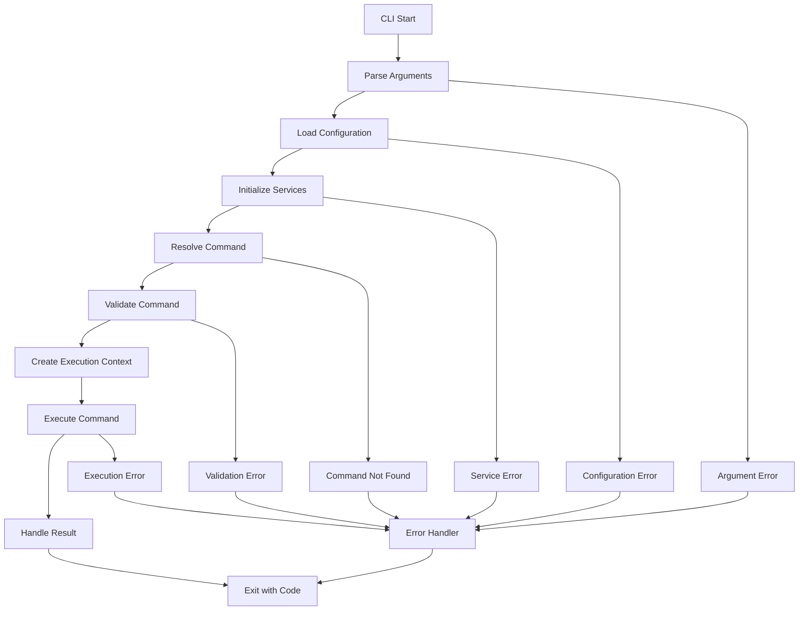

# CLI Execution Flow and Error Handling

This document outlines the detailed command execution flow and comprehensive error handling strategy for the SODAF CLI system.

## Command Execution Flow

### Overall Execution Lifecycle



### Detailed Execution Steps

#### 1. CLI Initialization (`src/cli/index.ts`)

```typescript
async function main(): Promise<number> {
    try {
        // 1. Parse raw command line arguments
        const rawArgs = process.argv.slice(2);
        
        // 2. Initialize argument parser
        const argsParser = new ArgumentParser();
        const parsedArgs = argsParser.parse(rawArgs);
        
        // 3. Load configuration
        const configService = new ConfigService();
        const config = await configService.loadConfig();
        
        // 4. Initialize services
        const services = await initializeServices(config);
        
        // 5. Resolve command
        const commandRegistry = new CommandRegistry();
        const command = commandRegistry.get(parsedArgs.command);
        
        if (!command) {
            throw new CLIError(
                `Command '${parsedArgs.command}' not found`,
                'COMMAND_NOT_FOUND',
                'command'
            );
        }
        
        // 6. Validate command arguments
        const validation = argsParser.validate(parsedArgs, command);
        if (!validation.valid) {
            throw new CLIError(
                `Invalid arguments: ${validation.errors.join(', ')}`,
                'INVALID_ARGUMENTS',
                'validation'
            );
        }
        
        // 7. Create execution context
        const context = await createExecutionContext(
            config,
            services,
            parsedArgs
        );
        
        // 8. Execute command
        const exitCode = await command.execute(parsedArgs, context);
        
        // 9. Clean up resources
        await cleanup(context);
        
        return exitCode;
        
    } catch (error) {
        return handleFatalError(error);
    }
}
```

#### 2. Service Initialization

```typescript
async function initializeServices(config: CLIConfig): Promise<Services> {
    const services = new Services();
    
    try {
        // Initialize logger first
        services.logger = new Logger(config.logLevel);
        
        // Initialize output handler
        services.output = new OutputHandler({
            colors: config.colors,
            format: config.outputFormat
        });
        
        // Initialize progress reporter
        services.progress = new ProgressReporter(services.output);
        
        // Initialize error handler
        services.errorHandler = new ErrorHandler(
            services.logger,
            services.output
        );
        
        // Initialize configuration service
        services.configService = new ConfigService(config);
        
        // Initialize site service
        services.siteService = new SiteService(
            services.configService,
            services.logger
        );
        
        // Initialize migration service
        services.migrationService = new MigrationService(
            services.siteService,
            services.logger
        );
        
        return services;
        
    } catch (error) {
        throw new CLIError(
            `Failed to initialize services: ${error.message}`,
            'SERVICE_INITIALIZATION_ERROR',
            'system',
            { recoverable: false }
        );
    }
}
```

#### 3. Execution Context Creation

```typescript
async function createExecutionContext(
    config: CLIConfig,
    services: Services,
    args: CommandArgs
): Promise<ExecutionContext> {
    const context: ExecutionContext = {
        config,
        startTime: Date.now(),
        logger: services.logger,
        output: services.output,
        progress: services.progress,
        errorHandler: services.errorHandler
    };
    
    // Load site context if required
    const siteName = args.getOption('site') || config.defaultSite;
    if (siteName) {
        try {
            context.site = await services.siteService.getSiteContext(siteName);
        } catch (error) {
            throw new CLIError(
                `Failed to load site '${siteName}': ${error.message}`,
                'SITE_LOAD_ERROR',
                'site',
                { site: siteName }
            );
        }
    }
    
    return context;
}
```

#### 4. Command Execution Pattern

```typescript
abstract class BaseCommand implements Command {
    abstract name: string;
    abstract description: string;
    abstract usage: string;
    abstract examples: string[];
    abstract options: CommandOption[];
    
    async execute(args: CommandArgs, context: ExecutionContext): Promise<number> {
        try {
            // 1. Pre-execution setup
            await this.setup(args, context);
            
            // 2. Validate prerequisites
            await this.validatePrerequisites(args, context);
            
            // 3. Execute command logic
            const result = await this.executeInternal(args, context);
            
            // 4. Post-execution cleanup
            await this.cleanup(args, context);
            
            // 5. Return success exit code
            return 0;
            
        } catch (error) {
            return this.handleError(error, context);
        }
    }
    
    protected abstract executeInternal(
        args: CommandArgs,
        context: ExecutionContext
    ): Promise<any>;
    
    protected async setup(
        args: CommandArgs,
        context: ExecutionContext
    ): Promise<void> {
        // Default implementation - can be overridden
        if (context.config.verbose) {
            context.output.debug(`Executing command: ${this.name}`);
        }
    }
    
    protected async validatePrerequisites(
        args: CommandArgs,
        context: ExecutionContext
    ): Promise<void> {
        // Check if site context is required
        if (this.requiresSite && !context.site) {
            throw new CLIError(
                `Command '${this.name}' requires a site context`,
                'SITE_CONTEXT_REQUIRED',
                'validation'
            );
        }
        
        // Validate site-specific prerequisites
        if (context.site) {
            await this.validateSitePrerequisites(args, context);
        }
    }
    
    protected async validateSitePrerequisites(
        args: CommandArgs,
        context: ExecutionContext
    ): Promise<void> {
        // Check database connection
        try {
            await context.site.database.ping();
        } catch (error) {
            throw new CLIError(
                `Database connection failed: ${error.message}`,
                'DATABASE_CONNECTION_ERROR',
                'database',
                { site: context.site?.config.name }
            );
        }
    }
    
    protected handleError(
        error: Error,
        context: ExecutionContext
    ): number {
        return context.errorHandler.handle(error, context);
    }
}
```

## Error Handling Strategy

### Error Categories and Handling

#### 1. Configuration Errors

```typescript
class ConfigurationErrorHandler {
    handle(error: CLIError, context: ExecutionContext): number {
        context.output.error('Configuration Error:');
        context.output.error(`  ${error.message}`);
        
        if (error.context?.site) {
            context.output.error(`  Site: ${error.context.site}`);
        }
        
        // Provide helpful suggestions
        if (error.code === 'SITE_NOT_FOUND') {
            context.output.info('Available sites:');
            const sites = await context.siteService.getAllSites();
            sites.forEach(site => {
                context.output.info(`  - ${site.name}`);
            });
            context.output.info('Use --site=<name> to specify a site');
        }
        
        if (error.code === 'INVALID_CONFIG') {
            context.output.info('Check your configuration files:');
            context.output.info(`  Global: ${context.config.configPath}`);
            context.output.info(`  Sites: ${context.config.sitesDir}`);
        }
        
        return 1; // Exit code for configuration errors
    }
}
```

#### 2. Migration Errors

```typescript
class MigrationErrorHandler {
    handle(error: CLIError, context: ExecutionContext): number {
        context.output.error('Migration Error:');
        context.output.error(`  ${error.message}`);
        
        if (error.context?.doctype) {
            context.output.error(`  DocType: ${error.context.doctype}`);
        }
        
        if (error.context?.migrationId) {
            context.output.error(`  Migration: ${error.context.migrationId}`);
        }
        
        // Provide recovery suggestions
        if (error.suggestions) {
            context.output.info('Suggestions:');
            error.suggestions.forEach(suggestion => {
                context.output.info(`  - ${suggestion}`);
            });
        }
        
        // For migration errors, suggest rollback
        if (error.severity === 'high' && error.context?.migrationId) {
            context.output.warn(
                'Consider rolling back the last migration: ' +
                'sodaf migrate:rollback --steps=1'
            );
        }
        
        return 2; // Exit code for migration errors
    }
}
```

#### 3. Database Errors

```typescript
class DatabaseErrorHandler {
    handle(error: CLIError, context: ExecutionContext): number {
        context.output.error('Database Error:');
        context.output.error(`  ${error.message}`);
        
        if (error.context?.site) {
            context.output.error(`  Site: ${error.context.site}`);
        }
        
        // Check common database issues
        if (error.code === 'DATABASE_LOCKED') {
            context.output.info(
                'Database is locked. Make sure no other processes are using it.'
            );
            context.output.info(
                'Try again in a few moments or restart the application.'
            );
        }
        
        if (error.code === 'DATABASE_CORRUPT') {
            context.output.warn(
                'Database appears to be corrupted. Consider restoring from backup.'
            );
            if (context.site?.config.database.path) {
                context.output.info(
                    `Database location: ${context.site.config.database.path}`
                );
            }
        }
        
        if (error.code === 'PERMISSION_DENIED') {
            context.output.info(
                'Check file permissions for the database file and directory.'
            );
        }
        
        return 3; // Exit code for database errors
    }
}
```

#### 4. File System Errors

```typescript
class FileSystemErrorHandler {
    handle(error: CLIError, context: ExecutionContext): number {
        context.output.error('File System Error:');
        context.output.error(`  ${error.message}`);
        
        if (error.context?.path) {
            context.output.error(`  Path: ${error.context.path}`);
        }
        
        // Provide specific guidance
        if (error.code === 'FILE_NOT_FOUND') {
            context.output.info(
                'Check if the file exists and the path is correct.'
            );
        }
        
        if (error.code === 'PERMISSION_DENIED') {
            context.output.info(
                'Check file/directory permissions and user access rights.'
            );
        }
        
        if (error.code === 'DISK_FULL') {
            context.output.info(
                'Free up disk space and try again.'
            );
        }
        
        return 4; // Exit code for file system errors
    }
}
```

### Error Handler Implementation

```typescript
class ErrorHandler {
    private handlers: Map<ErrorCategory, ErrorHandlerFunction>;
    private logger: Logger;
    private output: OutputHandler;
    
    constructor(logger: Logger, output: OutputHandler) {
        this.logger = logger;
        this.output = output;
        this.initializeHandlers();
    }
    
    private initializeHandlers(): void {
        this.handlers = new Map([
            ['configuration', new ConfigurationErrorHandler()],
            ['migration', new MigrationErrorHandler()],
            ['database', new DatabaseErrorHandler()],
            ['filesystem', new FileSystemErrorHandler()],
            ['site', new SiteErrorHandler()],
            ['validation', new ValidationErrorHandler()],
            ['system', new SystemErrorHandler()]
        ]);
    }
    
    handle(error: Error, context: ExecutionContext): number {
        // Convert to CLI error if needed
        const cliError = this.normalizeError(error);
        
        // Log error details
        this.logError(cliError, context);
        
        // Get appropriate handler
        const handler = this.handlers.get(cliError.category);
        if (handler) {
            return handler.handle(cliError, context);
        }
        
        // Fallback to generic handler
        return this.handleGenericError(cliError, context);
    }
    
    private normalizeError(error: Error): CLIError {
        if (error instanceof CLIError) {
            return error;
        }
        
        // Convert common errors to CLI errors
        if (error.message.includes('ENOENT')) {
            return new CLIError(
                `File not found: ${error.message}`,
                'FILE_NOT_FOUND',
                'filesystem',
                { recoverable: true }
            );
        }
        
        if (error.message.includes('EACCES')) {
            return new CLIError(
                `Permission denied: ${error.message}`,
                'PERMISSION_DENIED',
                'filesystem',
                { recoverable: false }
            );
        }
        
        // Generic error conversion
        return new CLIError(
            error.message,
            'UNKNOWN_ERROR',
            'unknown',
            { recoverable: true, originalError: error }
        );
    }
    
    private logError(error: CLIError, context: ExecutionContext): void {
        const logEntry = {
            timestamp: new Date(),
            error: {
                code: error.code,
                message: error.message,
                category: error.category,
                site: error.context?.site,
                doctype: error.context?.doctype,
                stack: error.stack
            },
            context: {
                command: context.config.command,
                args: context.config.args,
                site: context.site?.config.name
            }
        };
        
        this.logger.error('CLI Error', logEntry);
    }
    
    private handleGenericError(
        error: CLIError,
        context: ExecutionContext
    ): number {
        context.output.error('An unexpected error occurred:');
        context.output.error(`  ${error.message}`);
        
        if (context.config.verbose) {
            context.output.debug('Stack trace:');
            context.output.debug(error.stack || 'No stack trace available');
        }
        
        context.output.info(
            'Please report this issue with the error details above.'
        );
        
        return 1; // Generic error exit code
    }
}
```

### Exit Code Strategy

```typescript
enum ExitCodes {
    SUCCESS = 0,
    GENERAL_ERROR = 1,
    CONFIGURATION_ERROR = 1,
    MIGRATION_ERROR = 2,
    DATABASE_ERROR = 3,
    FILESYSTEM_ERROR = 4,
    PERMISSION_ERROR = 5,
    VALIDATION_ERROR = 6,
    SITE_ERROR = 7,
    SYSTEM_ERROR = 8,
    USER_INTERRUPT = 130,
    TIMEOUT = 124
}

class ExitCodeManager {
    static getExitCode(category: ErrorCategory, severity?: string): number {
        switch (category) {
            case 'configuration':
            case 'validation':
                return ExitCodes.CONFIGURATION_ERROR;
            
            case 'migration':
                return ExitCodes.MIGRATION_ERROR;
            
            case 'database':
                return ExitCodes.DATABASE_ERROR;
            
            case 'filesystem':
                return ExitCodes.FILESYSTEM_ERROR;
            
            case 'permission':
                return ExitCodes.PERMISSION_ERROR;
            
            case 'site':
                return ExitCodes.SITE_ERROR;
            
            case 'system':
                return ExitCodes.SYSTEM_ERROR;
            
            default:
                return ExitCodes.GENERAL_ERROR;
        }
    }
}
```

### Graceful Shutdown

```typescript
class GracefulShutdown {
    private static shutdownHandlers: (() => Promise<void>)[] = [];
    
    static registerHandler(handler: () => Promise<void>): void {
        this.shutdownHandlers.push(handler);
    }
    
    static async shutdown(signal: string): Promise<void> {
        console.log(`\nReceived ${signal}. Shutting down gracefully...`);
        
        try {
            // Execute all shutdown handlers
            for (const handler of this.shutdownHandlers) {
                await handler();
            }
            
            console.log('Graceful shutdown completed.');
            process.exit(0);
            
        } catch (error) {
            console.error('Error during shutdown:', error.message);
            process.exit(1);
        }
    }
    
    static setup(): void {
        // Register signal handlers
        process.on('SIGINT', () => this.shutdown('SIGINT'));
        process.on('SIGTERM', () => this.shutdown('SIGTERM'));
        
        // Register unhandled exception handler
        process.on('uncaughtException', (error) => {
            console.error('Uncaught exception:', error.message);
            this.shutdown('uncaughtException');
        });
        
        // Register unhandled rejection handler
        process.on('unhandledRejection', (reason) => {
            console.error('Unhandled rejection:', reason);
            this.shutdown('unhandledRejection');
        });
    }
}
```

### Error Recovery Strategies

```typescript
class ErrorRecoveryManager {
    async attemptRecovery(
        error: CLIError,
        context: ExecutionContext
    ): Promise<RecoveryResult> {
        if (!error.recoverable) {
            return { success: false, reason: 'Error is not recoverable' };
        }
        
        switch (error.category) {
            case 'database':
                return await this.recoverDatabaseError(error, context);
            
            case 'filesystem':
                return await this.recoverFileSystemError(error, context);
            
            case 'migration':
                return await this.recoverMigrationError(error, context);
            
            default:
                return { success: false, reason: 'No recovery strategy available' };
        }
    }
    
    private async recoverDatabaseError(
        error: CLIError,
        context: ExecutionContext
    ): Promise<RecoveryResult> {
        if (error.code === 'DATABASE_LOCKED') {
            // Wait and retry
            context.output.info('Database is locked, waiting...');
            await this.delay(2000);
            
            try {
                await context.site.database.ping();
                return { success: true, action: 'Retried database connection' };
            } catch (retryError) {
                return { success: false, reason: 'Database still locked after retry' };
            }
        }
        
        return { success: false, reason: 'No database recovery available' };
    }
    
    private async recoverFileSystemError(
        error: CLIError,
        context: ExecutionContext
    ): Promise<RecoveryResult> {
        if (error.code === 'FILE_NOT_FOUND' && error.context?.path) {
            // Try to create missing directory
            const dir = path.dirname(error.context.path);
            try {
                await fs.mkdir(dir, { recursive: true });
                return { success: true, action: 'Created missing directory' };
            } catch (mkdirError) {
                return { success: false, reason: 'Failed to create directory' };
            }
        }
        
        return { success: false, reason: 'No filesystem recovery available' };
    }
    
    private delay(ms: number): Promise<void> {
        return new Promise(resolve => setTimeout(resolve, ms));
    }
}

interface RecoveryResult {
    success: boolean;
    action?: string;
    reason?: string;
}
```

This comprehensive error handling system ensures that the CLI provides clear, actionable error messages with appropriate exit codes and recovery strategies when possible.