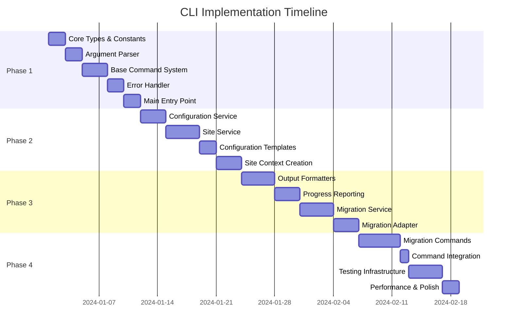

# CLI Commands Implementation Plan

This document provides a comprehensive implementation plan for the CLI Commands feature (P2-017) in SODAF framework.

## Implementation Overview

The CLI Commands feature will be implemented in 4 phases, with each phase building upon the previous one. This approach ensures incremental delivery, testing, and validation.

## Phase 1: Core Infrastructure (Week 1-2)

### Objectives
- Establish foundational CLI architecture
- Implement basic command parsing and routing
- Set up configuration system
- Create error handling framework

### Tasks

#### 1.1. Core Types and Constants
**File**: `src/cli/types.ts`, `src/cli/constants.ts`
**Effort**: 2 days
**Dependencies**: None

- Implement all CLI-specific TypeScript interfaces
- Define error codes and exit codes
- Create command option types
- Set up execution context interfaces

#### 1.2. Argument Parser
**File**: `src/cli/utils/args-parser.ts`
**Effort**: 2 days
**Dependencies**: Core types

- Parse command line arguments
- Validate options against command definitions
- Generate help text automatically
- Handle argument errors gracefully

#### 1.3. Base Command System
**Files**: `src/cli/commands/base-command.ts`, `src/cli/commands/command-registry.ts`
**Effort**: 3 days
**Dependencies**: Argument parser, types

- Implement abstract base command class
- Create command registry for discovery
- Add command validation framework
- Set up command middleware system

#### 1.4. Error Handler
**File**: `src/cli/utils/error-handler.ts`
**Effort**: 2 days
**Dependencies**: Types, constants

- Categorize errors by type
- Provide user-friendly error messages
- Generate appropriate exit codes
- Add recovery suggestions

#### 1.5. Main Entry Point
**File**: `src/cli/index.ts`
**Effort**: 2 days
**Dependencies**: All core components

- Implement main CLI entry point
- Set up graceful shutdown handling
- Initialize all services
- Route commands to appropriate handlers

### Deliverables
- Functional CLI entry point
- Basic command parsing and routing
- Error handling framework
- Core type definitions

### Acceptance Criteria
- [ ] CLI can parse basic commands
- [ ] Error handling produces user-friendly messages
- [ ] Exit codes are properly set
- [ ] Help system works for commands

## Phase 2: Configuration and Site Management (Week 3-4)

### Objectives
- Implement configuration management system
- Add multi-site support
- Create site context management
- Set up configuration validation

### Tasks

#### 2.1. Configuration Service
**File**: `src/cli/services/config-service.ts`
**Effort**: 3 days
**Dependencies**: Core infrastructure

- Load configuration from multiple sources
- Handle environment variables
- Validate configuration schemas
- Provide configuration merging

#### 2.2. Site Service
**File**: `src/cli/services/site-service.ts`
**Effort**: 4 days
**Dependencies**: Configuration service

- Manage site configurations
- Create site contexts with database connections
- Handle site lifecycle operations
- Validate site configurations

#### 2.3. Configuration Templates
**Files**: `src/cli/config/cli-config.ts`, `src/cli/config/site-config.ts`
**Effort**: 2 days
**Dependencies**: Configuration service

- Create default configuration templates
- Implement environment-specific configs
- Add configuration validation schemas
- Set up configuration migration

#### 2.4. Site Context Creation
**Files**: `src/lib/cli/adapters/` (adapters for migration system)
**Effort**: 3 days
**Dependencies**: Site service, existing migration system

- Create adapters for migration system integration
- Initialize database connections
- Set up DocType engine integration
- Create migration applier instances

### Deliverables
- Complete configuration management system
- Multi-site support
- Site context creation
- Configuration validation

### Acceptance Criteria
- [ ] CLI can load and save configuration
- [ ] Multiple sites can be managed
- [ ] Site contexts are created properly
- [ ] Configuration validation works

## Phase 3: Output System and Migration Integration (Week 5-6)

### Objectives
- Implement comprehensive output formatting
- Add progress reporting
- Integrate with existing migration system
- Create migration service layer

### Tasks

#### 3.1. Output Formatters
**Files**: `src/cli/output/formatter.ts`, `src/cli/output/table-formatter.ts`, `src/cli/output/json-formatter.ts`
**Effort**: 4 days
**Dependencies**: Core infrastructure

- Implement message formatting with colors
- Create table formatting for structured data
- Add JSON output support
- Handle terminal capabilities detection

#### 3.2. Progress Reporting
**Files**: `src/cli/output/progress.ts`, `src/cli/output/colors.ts`, `src/cli/output/symbols.ts`
**Effort**: 3 days
**Dependencies**: Output formatters

- Create progress bars and spinners
- Add multi-progress support
- Implement color and symbol management
- Handle terminal size changes

#### 3.3. Migration Service
**File**: `src/cli/services/migration-service.ts`
**Effort**: 4 days
**Dependencies**: Site service, output system

- Create high-level migration operations
- Integrate with existing MigrationApplier
- Add progress reporting to migrations
- Handle migration result formatting

#### 3.4. Migration Adapter
**File**: `src/lib/cli/adapters/migration-adapter.ts`
**Effort**: 3 days
**Dependencies**: Migration service, existing migration system

- Create adapter for migration system
- Add CLI-specific migration features
- Implement migration validation
- Handle migration history management

### Deliverables
- Complete output formatting system
- Progress reporting for long operations
- Full migration system integration
- Migration service layer

### Acceptance Criteria
- [ ] Output is properly formatted and colored
- [ ] Progress bars work for long operations
- [ ] Migration operations integrate with CLI
- [ ] Migration results are displayed correctly

## Phase 4: Migration Commands and Polish (Week 7-8)

### Objectives
- Implement all migration commands
- Add comprehensive testing
- Optimize performance
- Complete documentation

### Tasks

#### 4.1. Migration Commands
**Files**: `src/cli/commands/migrate/` (all migration command files)
**Effort**: 5 days
**Dependencies**: Migration service, output system

- Implement main migrate command
- Add status command with table output
- Create dry-run command
- Implement rollback command with safety checks

#### 4.2. Command Integration
**File**: `src/cli/commands/migrate/index.ts`
**Effort**: 1 day
**Dependencies**: All migration commands

- Register all migration commands
- Set up command dependencies
- Add command help system
- Implement command validation

#### 4.3. Testing Infrastructure
**Files**: `src/cli/__tests__/` (comprehensive test suite)
**Effort**: 4 days
**Dependencies**: All CLI components

- Create unit tests for all components
- Add integration tests for commands
- Implement end-to-end testing
- Set up test fixtures and mocks

#### 4.4. Performance and Polish
**Files**: Various optimizations across all CLI files
**Effort**: 2 days
**Dependencies**: Complete CLI implementation

- Optimize command execution performance
- Add comprehensive error messages
- Improve help text and examples
- Add shell completion support

### Deliverables
- Complete migration command implementation
- Comprehensive test suite
- Performance optimizations
- Production-ready CLI

### Acceptance Criteria
- [ ] All migration commands work as specified
- [ ] Test coverage exceeds 80%
- [ ] Performance meets requirements
- [ ] Documentation is complete

## Package.json Integration

### Updates Required
```json
{
	"bin": {
		"sodaf": "./dist/cli/index.js"
	},
	"scripts": {
		"build:cli": "tsc -p tsconfig.cli.json",
		"cli": "node dist/cli/index.js",
		"cli:test": "npm run build:cli && node dist/cli/index.js"
	},
	"devDependencies": {
		"commander": "^11.0.0",
		"inquirer": "^9.0.0",
		"chalk": "^5.0.0",
		"ora": "^7.0.0",
		"cli-table3": "^0.6.0"
	}
}
```

### TypeScript Configuration
Create `tsconfig.cli.json`:
```json
{
	"extends": "./tsconfig.json",
	"compilerOptions": {
		"outDir": "./dist/cli",
		"rootDir": "./src/cli",
		"module": "CommonJS",
		"target": "ES2020"
	},
	"include": ["src/cli/**/*"],
	"exclude": ["src/cli/__tests__/**/*"]
}
```

## Testing Strategy

### Unit Testing
- **Framework**: Vitest (already in project)
- **Coverage Target**: >80%
- **Test Files**: Mirror source structure in `__tests__` directories

### Integration Testing
- **Database Testing**: Use in-memory SQLite
- **Migration Testing**: Mock migration scenarios
- **Site Management**: Test site creation/deletion
- **Command Testing**: Test full command workflows

### End-to-End Testing
- **CLI Execution**: Test actual CLI commands
- **File System**: Test configuration file operations
- **Error Scenarios**: Test error handling paths
- **Performance**: Test with large datasets

## Documentation Requirements

### Code Documentation
- All public interfaces documented with JSDoc
- Complex algorithms explained with comments
- Usage examples in command files
- Architecture decisions documented

### User Documentation
- Command usage help
- Configuration guide
- Troubleshooting guide
- Migration workflow documentation

## Risk Mitigation

### Technical Risks
1. **Migration System Integration**
   - **Risk**: Changes to migration system may break CLI
   - **Mitigation**: Create adapter layer with version compatibility

2. **Database Connection Management**
   - **Risk**: Connection leaks in multi-site scenarios
   - **Mitigation**: Implement connection pooling and proper cleanup

3. **Configuration Complexity**
   - **Risk**: Configuration becomes too complex for users
   - **Mitigation**: Provide sensible defaults and templates

### Project Risks
1. **Timeline Pressure**
   - **Risk**: 8-week timeline may be tight
   - **Mitigation**: Prioritize core features, defer advanced ones

2. **Resource Constraints**
   - **Risk**: Development resources may be limited
   - **Mitigation**: Focus on highest-impact features first

## Success Metrics

### Functional Metrics
- [ ] All P2-017 test cases pass
- [ ] CLI handles all specified commands
- [ ] Error scenarios handled gracefully
- [ ] Multi-site support works correctly

### Quality Metrics
- [ ] Code coverage >80%
- [ ] No critical security vulnerabilities
- [ ] Performance meets requirements
- [ ] Documentation is complete

### User Experience Metrics
- [ ] Commands are intuitive and discoverable
- [ ] Error messages are helpful
- [ ] Progress indicators are informative
- [ ] Configuration is manageable

## Implementation Timeline



## Conclusion

This implementation plan provides a structured approach to building the CLI Commands feature for SODAF. The phased approach ensures incremental delivery, testing, and validation while maintaining flexibility for changes and improvements.

The plan addresses all requirements from P2-017 task:
- All migration commands (migrate, dry-run, status, rollback)
- Site-specific operations
- Proper exit codes and error handling
- Progress output and warnings
- Integration with existing migration system

The architecture is designed to be extensible for future commands and maintainable for long-term development.