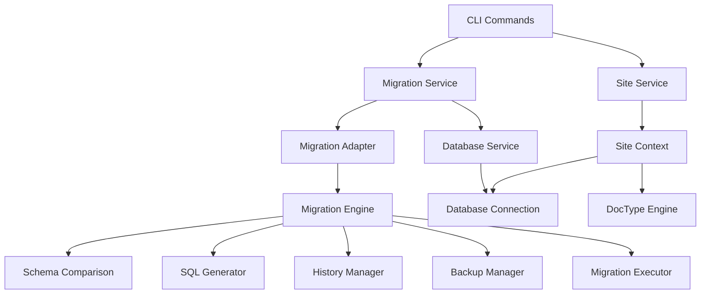

# CLI Migration System Integration

This document outlines how the CLI system integrates with the existing migration infrastructure in SODAF framework.

## Integration Architecture

### High-Level Integration



### Migration Service Implementation

```typescript
// src/cli/services/migration-service.ts
export class MigrationService {
	private siteService: SiteService;
	private migrationApplier: MigrationApplier;
	private logger: Logger;
	private output: OutputHandler;
	
	constructor(
		siteService: SiteService,
		logger: Logger,
		output: OutputHandler
	) {
		this.siteService = siteService;
		this.logger = logger;
		this.output = output;
	}
	
	/**
	 * Run all pending migrations for a site
	 */
	async runMigrations(
		options: MigrationCommandOptions
	): Promise<CLIMigrationResult> {
		const startTime = Date.now();
		const siteContext = await this.getSiteContext(options.site);
		
		try {
			// Get migration applier for the site
			const applier = await this.getMigrationApplier(siteContext);
			
			// Convert CLI options to migration options
			const migrationOptions = this.convertOptions(options);
			
			// Run migrations with progress reporting
			const result = await this.executeWithProgress(
				'Running migrations',
				() => applier.syncAllDocTypes(migrationOptions)
			);
			
			// Convert to CLI result
			return this.convertToCLIResult(result, startTime);
			
		} catch (error) {
			throw new CLIError(
				`Migration failed: ${error.message}`,
				'MIGRATION_ERROR',
				'migration',
				{
					site: options.site,
					recoverable: true,
					suggestions: [
						'Check database connection',
						'Verify migration files',
						'Try running with --verbose for more details'
					]
				}
			);
		}
	}
	
	/**
	 * Get migration status for a site
	 */
	async getStatus(
		options: StatusCommandOptions
	): Promise<MigrationStatus> {
		const siteContext = await this.getSiteContext(options.site);
		const applier = await this.getMigrationApplier(siteContext);
		
		// Get migration history
		const history = await applier.getMigrationHistory();
		
		// Get pending migrations
		const pending = await applier.getPendingMigrations();
		
		// Build status object
		return {
			site: options.site || 'default',
			status: pending.length > 0 ? 'pending' : 'up-to-date',
			stats: this.calculateStats(history, pending),
			doctypes: await this.getDocTypeStatuses(applier),
			lastMigration: history.lastMigration,
			pending,
			failed: history.failedMigrations
		};
	}
	
	/**
	 * Rollback migrations
	 */
	async rollback(
		options: RollbackCommandOptions
	): Promise<CLIMigrationResult> {
		const siteContext = await this.getSiteContext(options.site);
		const applier = await this.getMigrationApplier(siteContext);
		
		// Determine which migrations to rollback
		const migrationsToRollback = await this.getMigrationsToRollback(
			applier,
			options
		);
		
		if (migrationsToRollback.length === 0) {
			return {
				success: true,
				sql: [],
				warnings: ['No migrations to rollback'],
				errors: [],
				executionTime: 0,
				cli: {
					output: 'No migrations to rollback'
				}
			};
		}
		
		// Confirm rollback if not forced
		if (!options.force) {
			await this.confirmRollback(migrationsToRollback, options);
		}
		
		// Execute rollback
		const results = [];
		for (const migration of migrationsToRollback) {
			const result = await this.rollbackMigration(applier, migration);
			results.push(result);
		}
		
		return this.aggregateRollbackResults(results);
	}
	
	/**
	 * Perform dry run
	 */
	async dryRun(
		options: MigrationCommandOptions
	): Promise<DryRunResult> {
		const siteContext = await this.getSiteContext(options.site);
		const applier = await this.getMigrationApplier(siteContext);
		
		// Set dry run mode
		const dryRunOptions = {
			...this.convertOptions(options),
			dryRun: true
		};
		
		// Execute dry run
		const result = await applier.syncAllDocTypes(dryRunOptions);
		
		// Convert to dry run result
		return {
			success: true,
			sql: result.results.flatMap(r => r.sql || []),
			warnings: result.warnings,
			estimatedTime: this.estimateExecutionTime(result),
			destructive: this.hasDestructiveChanges(result),
			dataLossWarnings: this.extractDataLossWarnings(result),
			doctypes: await this.getDryRunDocTypeResults(result)
		};
	}
	
	private async getSiteContext(siteName?: string): Promise<SiteContext> {
		return await this.siteService.getSiteContext(
			siteName || 'default'
		);
	}
	
	private async getMigrationApplier(
		siteContext: SiteContext
	): Promise<MigrationApplier> {
		// Use the site's migration applier
		return siteContext.migrationApplier;
	}
	
	private convertOptions(
		cliOptions: MigrationCommandOptions
	): MigrationOptions {
		return {
			dryRun: cliOptions.dryRun,
			force: cliOptions.force,
			preserveData: true,
			backup: cliOptions.backup,
			continueOnError: cliOptions.continueOnError,
			batchSize: cliOptions.batchSize,
			timeout: cliOptions.timeout,
			validateData: true,
			context: {
				source: 'cli',
				user: process.env.USER || 'system'
			}
		};
	}
	
	private async executeWithProgress<T>(
		operation: string,
		task: () => Promise<T>
	): Promise<T> {
		// Progress reporting would be implemented here
		this.output.info(`Starting: ${operation}`);
		
		try {
			const result = await task();
			this.output.success(`Completed: ${operation}`);
			return result;
		} catch (error) {
			this.output.error(`Failed: ${operation} - ${error.message}`);
			throw error;
		}
	}
	
	private convertToCLIResult(
		result: BatchMigrationResult,
		startTime: number
	): CLIMigrationResult {
		return {
			success: result.success,
			sql: Array.from(result.results.values())
				.flatMap(r => r.sql || []),
			warnings: result.warnings,
			errors: result.errors,
			executionTime: Date.now() - startTime,
			cli: {
				output: this.formatResultOutput(result)
			}
		};
	}
}
```

### Migration Adapter

```typescript
// src/lib/cli/adapters/migration-adapter.ts
export class MigrationAdapter {
	private migrationApplier: MigrationApplier;
	private siteContext: SiteContext;
	
	constructor(siteContext: SiteContext) {
		this.siteContext = siteContext;
		this.migrationApplier = siteContext.migrationApplier;
	}
	
	/**
	 * Get migration history with CLI-friendly format
	 */
	async getMigrationHistory(
		doctypeName?: string
	): Promise<CLIMigrationHistory> {
		const history = await this.migrationApplier.getMigrationHistory(
			doctypeName
		);
		
		return {
			migrations: history.migrations.map(m => ({
				...m,
				formattedDate: this.formatDate(m.timestamp),
				formattedDuration: this.formatDuration(m.executionTime || 0),
				status: m.applied ? 'applied' : 'pending'
			})),
			stats: history.stats,
			lastMigration: history.lastMigration,
			pendingMigrations: history.pendingMigrations,
			failedMigrations: history.failedMigrations
		};
	}
	
	/**
	 * Get pending migrations with detailed information
	 */
	async getPendingMigrations(
		doctypeName?: string
	): Promise<CLIPendingMigration[]> {
		const pending = await this.migrationApplier.getPendingMigrations(
			doctypeName
		);
		
		return pending.map(m => ({
			...m,
			estimatedTime: this.estimateMigrationTime(m),
			destructive: m.destructive,
			dataLossRisk: this.assessDataLossRisk(m),
			sqlCount: Array.isArray(m.sql) ? m.sql.length : 1
		}));
	}
	
	/**
	 * Validate migration before execution
	 */
	async validateMigration(
		migration: Migration
	): Promise<CLIMigrationValidation> {
		const validation = await this.migrationApplier.validateMigration(
			migration
		);
		
		return {
			...validation,
			cliWarnings: this.categorizeWarnings(validation.warnings),
			riskLevel: this.assessRiskLevel(migration, validation),
			recommendations: this.generateRecommendations(validation)
		};
	}
	
	/**
	 * Execute migration with enhanced progress reporting
	 */
	async executeMigrationWithProgress(
		migration: Migration,
		progressReporter: ProgressReporter
	): Promise<CLIMigrationResult> {
		progressReporter.start(
			`Applying migration: ${migration.id}`,
			100
		);
		
		try {
			// Start migration
			progressReporter.update(10, 'Validating migration');
			await this.validateMigration(migration);
			
			// Create backup if needed
			if (migration.requiresBackup) {
				progressReporter.update(20, 'Creating backup');
				await this.createBackup(migration.doctype);
			}
			
			// Execute migration
			progressReporter.update(50, 'Executing migration');
			const result = await this.migrationApplier.applyMigration(
				migration
			);
			
			// Complete
			progressReporter.update(100, 'Migration completed');
			
			return {
				...result,
				cli: {
					output: `Successfully applied migration: ${migration.id}`,
					progress: progressReporter.getUpdates()
				}
			};
			
		} catch (error) {
			progressReporter.error(`Migration failed: ${error.message}`);
			throw error;
		}
	}
	
	private formatDate(date: Date): string {
		return date.toLocaleString();
	}
	
	private formatDuration(ms: number): string {
		if (ms < 1000) return `${ms}ms`;
		if (ms < 60000) return `${(ms / 1000).toFixed(1)}s`;
		return `${(ms / 60000).toFixed(1)}m`;
	}
	
	private estimateMigrationTime(migration: Migration): number {
		// Simple estimation based on migration complexity
		const baseTime = 1000; // 1 second base
		const sqlComplexity = Array.isArray(migration.sql) 
			? migration.sql.length 
			: 1;
		const dataComplexity = migration.requiresBackup ? 2 : 1;
		
		return baseTime * sqlComplexity * dataComplexity;
	}
	
	private assessDataLossRisk(migration: Migration): 'low' | 'medium' | 'high' {
		if (!migration.destructive) return 'low';
		if (migration.requiresBackup) return 'medium';
		return 'high';
	}
	
	private categorizeWarnings(
		warnings: ValidationWarning[]
	): Record<string, ValidationWarning[]> {
		const categorized: Record<string, ValidationWarning[]> = {};
		
		warnings.forEach(warning => {
			const category = warning.type || 'other';
			if (!categorized[category]) {
				categorized[category] = [];
			}
			categorized[category].push(warning);
		});
		
		return categorized;
	}
	
	private assessRiskLevel(
		migration: Migration,
		validation: MigrationValidation
	): 'low' | 'medium' | 'high' | 'critical' {
		if (validation.errors.length > 0) return 'critical';
		if (migration.destructive) return 'high';
		if (validation.warnings.length > 5) return 'medium';
		return 'low';
	}
	
	private generateRecommendations(
		validation: MigrationValidation
	): string[] {
		const recommendations: string[] = [];
		
		if (validation.warnings.some(w => w.type === 'data_loss')) {
			recommendations.push('Create backup before applying');
		}
		
		if (validation.warnings.some(w => w.type === 'performance')) {
			recommendations.push('Apply during low-traffic period');
		}
		
		if (validation.errors.length > 0) {
			recommendations.push('Fix errors before applying');
		}
		
		return recommendations;
	}
}
```

### Site Service Integration

```typescript
// src/cli/services/site-service.ts
export class SiteService {
	private configService: ConfigService;
	private logger: Logger;
	private siteContexts: Map<string, SiteContext> = new Map();
	
	constructor(configService: ConfigService, logger: Logger) {
		this.configService = configService;
		this.logger = logger;
	}
	
	/**
	 * Get site context with migration infrastructure
	 */
	async getSiteContext(siteName: string): Promise<SiteContext> {
		// Check cache first
		if (this.siteContexts.has(siteName)) {
			return this.siteContexts.get(siteName)!;
		}
		
		// Load site configuration
		const siteConfig = await this.loadSiteConfig(siteName);
		
		// Initialize database connection
		const database = await this.initializeDatabase(siteConfig);
		
		// Initialize DocType engine
		const doctypeEngine = await this.initializeDocTypeEngine(database);
		
		// Initialize migration applier
		const migrationApplier = await this.initializeMigrationApplier(
			database,
			doctypeEngine
		);
		
		// Create site context
		const context: SiteContext = {
			config: siteConfig,
			database,
			doctypeEngine,
			migrationApplier,
			logger: this.logger.child({ site: siteName }),
			workingDir: this.getSiteWorkingDir(siteName)
		};
		
		// Cache context
		this.siteContexts.set(siteName, context);
		
		return context;
	}
	
	private async loadSiteConfig(siteName: string): Promise<SiteConfig> {
		const configPath = path.join(
			this.configService.get('sitesDir'),
			siteName,
			'site.json'
		);
		
		try {
			const configData = await fs.readFile(configPath, 'utf-8');
			const config = JSON.parse(configData);
			
			// Validate configuration
			await this.validateSiteConfig(config);
			
			return config;
			
		} catch (error) {
			throw new CLIError(
				`Failed to load site configuration for '${siteName}': ${error.message}`,
				'SITE_CONFIG_ERROR',
				'site',
				{ site: siteName, path: configPath }
			);
		}
	}
	
	private async initializeDatabase(
		siteConfig: SiteConfig
	): Promise<Database> {
		try {
			const Database = await import('../../core/database/database').then(m => m.Database);
			return new Database(siteConfig.database);
		} catch (error) {
			throw new CLIError(
				`Failed to initialize database: ${error.message}`,
				'DATABASE_INIT_ERROR',
				'database',
				{ site: siteConfig.name }
			);
		}
	}
	
	private async initializeDocTypeEngine(
		database: Database
	): Promise<DocTypeEngine> {
		try {
			const DocTypeEngine = await import('../../meta/doctype/doctype-engine')
				.then(m => m.DocTypeEngine);
			return new DocTypeEngine(database);
		} catch (error) {
			throw new CLIError(
				`Failed to initialize DocType engine: ${error.message}`,
				'DOCTYPE_ENGINE_ERROR',
				'system'
			);
		}
	}
	
	private async initializeMigrationApplier(
		database: Database,
		doctypeEngine: DocTypeEngine
	): Promise<MigrationApplier> {
		try {
			const MigrationApplier = await import('../../meta/migration/apply')
				.then(m => m.MigrationApplier);
			
			const defaultOptions = {
				dryRun: false,
				force: false,
				preserveData: true,
				backup: true,
				continueOnError: false,
				batchSize: 1000,
				timeout: 300,
				validateData: true,
				context: {}
			};
			
			return new MigrationApplier(database, doctypeEngine, defaultOptions);
		} catch (error) {
			throw new CLIError(
				`Failed to initialize migration applier: ${error.message}`,
				'MIGRATION_APPLIER_ERROR',
				'system'
			);
		}
	}
	
	private async validateSiteConfig(config: any): Promise<void> {
		// Basic validation
		if (!config.name) {
			throw new Error('Site name is required');
		}
		
		if (!config.database) {
			throw new Error('Database configuration is required');
		}
		
		if (!config.database.path) {
			throw new Error('Database path is required');
		}
		
		// Check if database file exists
		if (!await fs.pathExists(config.database.path)) {
			throw new Error(`Database file not found: ${config.database.path}`);
		}
	}
	
	private getSiteWorkingDir(siteName: string): string {
		return path.join(
			this.configService.get('sitesDir'),
			siteName
		);
	}
}
```

### Command Integration Examples

#### Migrate Command Integration

```typescript
// src/cli/commands/migrate/migrate.ts
export class MigrateCommand extends BaseCommand {
	name = 'migrate';
	description = 'Run pending database migrations';
	usage = 'sodaf migrate [options]';
	examples = [
		'sodaf migrate',
		'sodaf migrate --site=production',
		'sodaf migrate --force --verbose'
	];
	
	options: CommandOption[] = [
		{
			name: 'site',
			short: 's',
			long: 'site',
			description: 'Target site name',
			type: 'string',
			default: 'default'
		},
		{
			name: 'force',
			short: 'f',
			long: 'force',
			description: 'Force migration without confirmation',
			type: 'boolean'
		},
		{
			name: 'verbose',
			short: 'v',
			long: 'verbose',
			description: 'Verbose output',
			type: 'boolean'
		},
		{
			name: 'dry-run',
			long: 'dry-run',
			description: 'Show what would be migrated without executing',
			type: 'boolean'
		}
	];
	
	protected async executeInternal(
		args: CommandArgs,
		context: ExecutionContext
	): Promise<void> {
		const migrationService = new MigrationService(
			context.services.siteService,
			context.logger,
			context.output
		);
		
		const options = this.parseMigrationOptions(args);
		
		// Check if dry run
		if (options.dryRun) {
			const result = await migrationService.dryRun(options);
			this.displayDryRunResult(result, context);
			return;
		}
		
		// Run migrations
		const result = await migrationService.runMigrations(options);
		this.displayMigrationResult(result, context);
	}
	
	private parseMigrationOptions(args: CommandArgs): MigrationCommandOptions {
		return {
			site: args.getOption('site'),
			force: args.hasFlag('force'),
			verbose: args.hasFlag('verbose'),
			dryRun: args.hasFlag('dry-run'),
			timeout: args.getOption('timeout') || 300,
			backup: !args.hasFlag('no-backup'),
			batchSize: args.getOption('batch-size') || 1000,
			continueOnError: args.hasFlag('continue-on-error')
		};
	}
	
	private displayMigrationResult(
		result: CLIMigrationResult,
		context: ExecutionContext
	): void {
		if (result.success) {
			context.output.success('Migrations completed successfully');
			
			if (result.warnings.length > 0) {
				context.output.warn('Warnings:');
				result.warnings.forEach(warning => {
					context.output.warn(`  ${warning}`);
				});
			}
			
			context.output.info(`Execution time: ${result.executionTime}ms`);
			
		} else {
			context.output.error('Migration failed');
			result.errors.forEach(error => {
				context.output.error(`  ${error}`);
			});
		}
	}
	
	private displayDryRunResult(
		result: DryRunResult,
		context: ExecutionContext
	): void {
		context.output.info('Dry run results:');
		context.output.info(`  SQL statements: ${result.sql.length}`);
		context.output.info(`  Destructive: ${result.destructive}`);
		
		if (result.warnings.length > 0) {
			context.output.warn('Warnings:');
			result.warnings.forEach(warning => {
				context.output.warn(`  ${warning}`);
			});
		}
		
		if (context.config.verbose && result.sql.length > 0) {
			context.output.info('SQL to be executed:');
			result.sql.forEach(sql => {
				context.output.info(`  ${sql}`);
			});
		}
	}
}
```

This integration design ensures that CLI commands can fully leverage the existing migration system while providing enhanced user experience through progress reporting, better error handling, and site management.