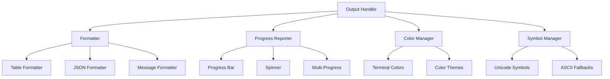

# CLI Output Formatting and Progress Reporting

This document outlines the design for output formatting, progress reporting, and user interaction in the SODAF CLI system.

## Output System Architecture

### Output Components



### Output Handler Implementation

```typescript
// src/cli/output/formatter.ts
export class OutputHandler {
	private formatter: MessageFormatter;
	private tableFormatter: TableFormatter;
	private jsonFormatter: JSONFormatter;
	private colorManager: ColorManager;
	private symbolManager: SymbolManager;
	private options: OutputFormatOptions;
	
	constructor(options: OutputFormatOptions = {}) {
		this.options = {
			colors: true,
			unicode: true,
			width: 80,
			indent: 2,
			timestamps: false,
			stackTraces: false,
			...options
		};
		
		this.colorManager = new ColorManager(this.options.colors);
		this.symbolManager = new SymbolManager(this.options.unicode);
		this.formatter = new MessageFormatter(this.colorManager, this.symbolManager);
		this.tableFormatter = new TableFormatter(this.options, this.colorManager);
		this.jsonFormatter = new JSONFormatter();
	}
	
	/**
	 * Write standard output message
	 */
	write(message: string, level: 'info' | 'success' | 'warn' | 'error' = 'info'): void {
		const formatted = this.formatter.format(message, level);
		process.stdout.write(formatted + '\n');
	}
	
	/**
	 * Write error message
	 */
	error(message: string): void {
		this.write(message, 'error');
	}
	
	/**
	 * Write warning message
	 */
	warn(message: string): void {
		this.write(message, 'warn');
	}
	
	/**
	 * Write success message
	 */
	success(message: string): void {
		this.write(message, 'success');
	}
	
	/**
	 * Write info message
	 */
	info(message: string): void {
		this.write(message, 'info');
	}
	
	/**
	 * Write debug message
	 */
	debug(message: string): void {
		if (process.env.DEBUG) {
			const formatted = this.formatter.format(message, 'debug');
			process.stderr.write(formatted + '\n');
		}
	}
	
	/**
	 * Format and write table
	 */
	table(data: string[][], headers?: string[]): void {
		const formatted = this.tableFormatter.format(data, headers);
		process.stdout.write(formatted + '\n');
	}
	
	/**
	 * Write JSON output
	 */
	json(data: any): void {
		const formatted = this.jsonFormatter.format(data);
		process.stdout.write(formatted + '\n');
	}
	
	/**
	 * Write blank line
	 */
	newline(): void {
		process.stdout.write('\n');
	}
	
	/**
	 * Clear screen
	 */
	clear(): void {
		process.stdout.write('\x1B[2J\x1B[0f');
	}
	
	/**
	 * Set output options
	 */
	setOptions(options: Partial<OutputFormatOptions>): void {
		this.options = { ...this.options, ...options };
		this.colorManager.setEnabled(this.options.colors);
		this.symbolManager.setUnicode(this.options.unicode);
	}
}
```

### Message Formatter

```typescript
// src/cli/output/formatter.ts (continued)
export class MessageFormatter {
	private colorManager: ColorManager;
	private symbolManager: SymbolManager;
	
	constructor(colorManager: ColorManager, symbolManager: SymbolManager) {
		this.colorManager = colorManager;
		this.symbolManager = symbolManager;
	}
	
	format(message: string, level: 'info' | 'success' | 'warn' | 'error' | 'debug'): string {
		const timestamp = this.getTimestamp();
		const prefix = this.getPrefix(level);
		const coloredMessage = this.colorMessage(message, level);
		
		return [timestamp, prefix, coloredMessage]
			.filter(Boolean)
			.join(' ');
	}
	
	private getTimestamp(): string {
		if (!this.options.timestamps) return '';
		
		const now = new Date();
		return `[${now.toISOString()}]`;
	}
	
	private getPrefix(level: string): string {
		const symbol = this.symbolManager.getSymbol(level);
		const color = this.getColorForLevel(level);
		return this.colorManager.colorize(symbol, color);
	}
	
	private colorMessage(message: string, level: string): string {
		const color = this.getColorForLevel(level);
		return this.colorManager.colorize(message, color);
	}
	
	private getColorForLevel(level: string): string {
		switch (level) {
			case 'success': return 'green';
			case 'warn': return 'yellow';
			case 'error': return 'red';
			case 'debug': return 'gray';
			default: return 'blue';
		}
	}
}
```

### Table Formatter

```typescript
// src/cli/output/table-formatter.ts
export class TableFormatter {
	private options: OutputFormatOptions;
	private colorManager: ColorManager;
	
	constructor(options: OutputFormatOptions, colorManager: ColorManager) {
		this.options = options;
		this.colorManager = colorManager;
	}
	
	format(data: string[][], headers?: string[]): string {
		if (data.length === 0) return 'No data to display';
		
		// Determine column widths
		const allRows = headers ? [headers, ...data] : data;
		const columnWidths = this.calculateColumnWidths(allRows);
		
		// Build table lines
		const lines: string[] = [];
		
		// Add headers if provided
		if (headers) {
			const headerLine = this.formatRow(headers, columnWidths);
			const separatorLine = this.createSeparator(columnWidths);
			lines.push(headerLine);
			lines.push(separatorLine);
		}
		
		// Add data rows
		data.forEach((row, index) => {
			const formattedRow = this.formatRow(row, columnWidths);
			lines.push(formattedRow);
		});
		
		return lines.join('\n');
	}
	
	private calculateColumnWidths(rows: string[][]): number[] {
		const columnCount = Math.max(...rows.map(row => row.length));
		const widths: number[] = [];
		
		for (let col = 0; col < columnCount; col++) {
			const maxWidth = Math.max(
				...rows.map(row => (row[col] || '').length)
			);
			widths[col] = Math.min(maxWidth + 2, this.options.width || 80);
		}
		
		return widths;
	}
	
	private formatRow(row: string[], columnWidths: number[]): string {
		const cells = row.map((cell, index) => {
			const width = columnWidths[index] || 20;
			const padded = this.padCell(cell || '', width);
			return this.colorizeCell(padded, index, row);
		});
		
		return this.options.unicode 
			? `│${cells.join('│')}│`
			: `|${cells.join('|')}|`;
	}
	
	private padCell(content: string, width: number): string {
		return content.padEnd(width - 2, ' ');
	}
	
	private colorizeCell(cell: string, columnIndex: number, row: string[]): string {
		// Add color coding based on content type
		if (this.isNumericCell(cell)) {
			return this.colorManager.colorize(cell, 'cyan');
		}
		
		if (this.isStatusCell(cell)) {
			return this.colorize.colorizeStatus(cell);
		}
		
		if (this.isErrorCell(cell)) {
			return this.colorManager.colorize(cell, 'red');
		}
		
		return cell;
	}
	
	private isNumericCell(cell: string): boolean {
		return /^[\d,.]+$/.test(cell.trim());
	}
	
	private isStatusCell(cell: string): boolean {
		const statuses = ['success', 'pending', 'failed', 'applied', 'up-to-date'];
		return statuses.includes(cell.toLowerCase().trim());
	}
	
	private isErrorCell(cell: string): boolean {
		return cell.toLowerCase().includes('error') || 
			   cell.toLowerCase().includes('failed');
	}
	
	private createSeparator(columnWidths: number[]): string {
		const separators = columnWidths.map(width => 
			'─'.repeat(width - 2)
		);
		
		return this.options.unicode
			? `├${separators.join('┼')}┤`
			: `+${separators.join('+')}+`;
	}
}
```

### JSON Formatter

```typescript
// src/cli/output/json-formatter.ts
export class JSONFormatter {
	private pretty: boolean = true;
	private indent: number = 2;
	
	constructor(pretty: boolean = true, indent: number = 2) {
		this.pretty = pretty;
		this.indent = indent;
	}
	
	format(data: any): string {
		try {
			return JSON.stringify(data, null, this.pretty ? this.indent : 0);
		} catch (error) {
			return JSON.stringify({
				error: 'Failed to serialize output',
				message: error.message,
				data: String(data)
			});
		}
	}
	
	setPretty(pretty: boolean): void {
		this.pretty = pretty;
	}
	
	setIndent(indent: number): void {
		this.indent = indent;
	}
}
```

## Progress Reporting System

### Progress Reporter

```typescript
// src/cli/output/progress.ts
export class ProgressReporter {
	private output: OutputHandler;
	private activeOperations: Map<string, ProgressOperation> = new Map();
	private currentOperation?: ProgressOperation;
	private multiProgressMode: boolean = false;
	
	constructor(output: OutputHandler) {
		this.output = output;
	}
	
	/**
	 * Start a new progress operation
	 */
	start(operation: string, total?: number): void {
		const progressOp: ProgressOperation = {
			name: operation,
			current: 0,
			total: total || 100,
			startTime: Date.now(),
			lastUpdate: Date.now(),
			updates: []
		};
		
		this.currentOperation = progressOp;
		this.activeOperations.set(operation, progressOp);
		
		this.displayProgress();
	}
	
	/**
	 * Update progress
	 */
	update(current: number, message?: string): void {
		if (!this.currentOperation) return;
		
		this.currentOperation.current = current;
		if (message) {
			this.currentOperation.message = message;
		}
		
		this.currentOperation.lastUpdate = Date.now();
		this.currentOperation.updates.push({
			timestamp: new Date(),
			current,
			message
		});
		
		this.displayProgress();
	}
	
	/**
	 * Increment progress by one
	 */
	increment(message?: string): void {
		if (!this.currentOperation) return;
		
		this.update(this.currentOperation.current + 1, message);
	}
	
	/**
	 * Set progress percentage
	 */
	setPercentage(percentage: number, message?: string): void {
		if (!this.currentOperation) return;
		
		const current = Math.floor((percentage / 100) * this.currentOperation.total);
		this.update(current, message);
	}
	
	/**
	 * Complete current operation
	 */
	complete(message?: string): void {
		if (!this.currentOperation) return;
		
		this.currentOperation.current = this.currentOperation.total;
		this.currentOperation.completed = true;
		this.currentOperation.endTime = Date.now();
		
		if (message) {
			this.currentOperation.message = message;
		}
		
		this.displayProgress();
		this.output.success(`✓ ${this.currentOperation.name} completed`);
		
		this.currentOperation = undefined;
	}
	
	/**
	 * Report warning during operation
	 */
	warn(message: string): void {
		if (this.currentOperation) {
			this.output.warn(`⚠ ${message}`);
		} else {
			this.output.warn(message);
		}
	}
	
	/**
	 * Report error during operation
	 */
	error(message: string): void {
		if (this.currentOperation) {
			this.output.error(`✗ ${message}`);
		} else {
			this.output.error(message);
		}
	}
	
	/**
	 * Create sub-progress for multi-operation scenarios
	 */
	subProgress(operation: string, total?: number): ProgressReporter {
		const subReporter = new ProgressReporter(this.output);
		subReporter.multiProgressMode = true;
		
		// Link to parent operation
		if (this.currentOperation) {
			subReporter.parentOperation = this.currentOperation;
		}
		
		return subReporter;
	}
	
	/**
	 * Get all progress updates
	 */
	getUpdates(): ProgressUpdate[] {
		return Array.from(this.activeOperations.values())
			.flatMap(op => op.updates);
	}
	
	private displayProgress(): void {
		if (!this.currentOperation) return;
		
		const percentage = this.calculatePercentage();
		const progressBar = this.createProgressBar(percentage);
		const timeInfo = this.getTimeInfo();
		const message = this.currentOperation.message || '';
		
		// Clear line and write progress
		process.stdout.write('\r' + ' '.repeat(process.stdout.columns || 80));
		process.stdout.write(`\r${progressBar} ${percentage}% ${timeInfo} ${message}`);
	}
	
	private calculatePercentage(): number {
		if (!this.currentOperation || !this.currentOperation.total) return 0;
		
		return Math.floor(
			(this.currentOperation.current / this.currentOperation.total) * 100
		);
	}
	
	private createProgressBar(percentage: number): string {
		const width = 20;
		const filled = Math.floor((percentage / 100) * width);
		const empty = width - filled;
		
		const filledBar = '█'.repeat(filled);
		const emptyBar = '░'.repeat(empty);
		
		return `[${filledBar}${emptyBar}]`;
	}
	
	private getTimeInfo(): string {
		if (!this.currentOperation) return '';
		
		const elapsed = Date.now() - this.currentOperation.startTime;
		const remaining = this.estimateRemainingTime(elapsed);
		
		return `(${this.formatDuration(elapsed)}${remaining ? `, ${remaining} left` : ''})`;
	}
	
	private estimateRemainingTime(elapsed: number): string {
		if (!this.currentOperation || !this.currentOperation.total) return '';
		
		const rate = this.currentOperation.current / elapsed;
		const remaining = (this.currentOperation.total - this.currentOperation.current) / rate;
		
		return this.formatDuration(remaining);
	}
	
	private formatDuration(ms: number): string {
		if (ms < 1000) return `${ms}ms`;
		if (ms < 60000) return `${(ms / 1000).toFixed(1)}s`;
		return `${(ms / 60000).toFixed(1)}m`;
	}
}

interface ProgressOperation {
	name: string;
	current: number;
	total: number;
	startTime: number;
	lastUpdate: number;
	endTime?: number;
	message?: string;
	completed?: boolean;
	updates: ProgressUpdate[];
	parentOperation?: ProgressOperation;
}
```

### Multi-Progress Support

```typescript
// src/cli/output/multi-progress.ts
export class MultiProgressReporter {
	private output: OutputHandler;
	private operations: Map<string, ProgressOperation> = new Map();
	private maxHeight: number = 0;
	
	constructor(output: OutputHandler) {
		this.output = output;
	}
	
	/**
	 * Add a new operation to track
	 */
	addOperation(id: string, name: string, total?: number): void {
		const operation: ProgressOperation = {
			id,
			name,
			current: 0,
			total: total || 100,
			startTime: Date.now(),
			updates: []
		};
		
		this.operations.set(id, operation);
		this.maxHeight = Math.max(this.maxHeight, this.operations.size);
		this.display();
	}
	
	/**
	 * Update operation progress
	 */
	updateOperation(id: string, current: number, message?: string): void {
		const operation = this.operations.get(id);
		if (!operation) return;
		
		operation.current = current;
		if (message) operation.message = message;
		
		this.display();
	}
	
	/**
	 * Complete operation
	 */
	completeOperation(id: string, message?: string): void {
		const operation = this.operations.get(id);
		if (!operation) return;
		
		operation.current = operation.total;
		operation.completed = true;
		if (message) operation.message = message;
		
		this.display();
	}
	
	/**
	 * Remove operation
	 */
	removeOperation(id: string): void {
		this.operations.delete(id);
		this.display();
	}
	
	private display(): void {
		// Clear previous output
		for (let i = 0; i < this.maxHeight; i++) {
			process.stdout.write('\r\x1B[K\x1B[1A');
		}
		
		// Display all operations
		const lines: string[] = [];
		this.operations.forEach((operation, id) => {
			const line = this.formatOperation(operation);
			lines.push(line);
		});
		
		// Write new output
		lines.forEach(line => {
			process.stdout.write(`${line}\n`);
		});
		
		this.maxHeight = lines.length;
	}
	
	private formatOperation(operation: ProgressOperation): string {
		const percentage = this.calculatePercentage(operation);
		const progressBar = this.createProgressBar(percentage);
		const status = operation.completed ? '✓' : '…';
		
		return `${status} ${operation.name}: ${progressBar} ${percentage}% ${operation.message || ''}`;
	}
	
	private calculatePercentage(operation: ProgressOperation): number {
		if (!operation.total) return 0;
		return Math.floor((operation.current / operation.total) * 100);
	}
	
	private createProgressBar(percentage: number): string {
		const width = 15;
		const filled = Math.floor((percentage / 100) * width);
		const empty = width - filled;
		
		const filledBar = '█'.repeat(filled);
		const emptyBar = '░'.repeat(empty);
		
		return `[${filledBar}${emptyBar}]`;
	}
}
```

## Color and Symbol Management

### Color Manager

```typescript
// src/cli/output/colors.ts
export class ColorManager {
	private enabled: boolean;
	private theme: ColorTheme;
	
	constructor(enabled: boolean = true, theme?: ColorTheme) {
		this.enabled = enabled && this.supportsColor();
		this.theme = theme || this.getDefaultTheme();
	}
	
	/**
	 * Colorize text with specified color
	 */
	colorize(text: string, color: string): string {
		if (!this.enabled) return text;
		
		const colorCode = this.theme.colors[color];
		if (!colorCode) return text;
		
		return `${colorCode}${text}\x1B[0m`;
	}
	
	/**
	 * Colorize status text
	 */
	colorizeStatus(status: string): string {
		const color = this.getStatusColor(status);
		return this.colorize(status, color);
	}
	
	/**
	 * Get color for status value
	 */
	getStatusColor(status: string): string {
		switch (status.toLowerCase()) {
			case 'success':
			case 'applied':
			case 'completed':
			case 'up-to-date':
				return 'green';
			
			case 'pending':
			case 'in-progress':
			case 'running':
				return 'yellow';
			
			case 'failed':
			case 'error':
			case 'critical':
				return 'red';
			
			case 'warning':
				return 'magenta';
			
			default:
				return 'blue';
		}
	}
	
	/**
	 * Enable or disable colors
	 */
	setEnabled(enabled: boolean): void {
		this.enabled = enabled && this.supportsColor();
	}
	
	/**
	 * Set color theme
	 */
	setTheme(theme: ColorTheme): void {
		this.theme = theme;
	}
	
	/**
	 * Check if terminal supports colors
	 */
	private supportsColor(): boolean {
		// Check environment variables
		if (process.env.NO_COLOR || process.env.FORCE_NO_COLOR) {
			return false;
		}
		
		if (process.env.FORCE_COLOR) {
			return true;
		}
		
		// Check if we're in a TTY
		if (!process.stdout.isTTY) {
			return false;
		}
		
		// Check common environment variables
		const term = process.env.TERM || '';
		const colorterm = process.env.COLORTERM || '';
		
		return term.includes('color') || 
			   term.includes('256') || 
			   colorterm.includes('truecolor') ||
			   colorterm.includes('24bit');
	}
	
	private getDefaultTheme(): ColorTheme {
		return {
			colors: {
				black: '\x1B[30m',
				red: '\x1B[31m',
				green: '\x1B[32m',
				yellow: '\x1B[33m',
				blue: '\x1B[34m',
				magenta: '\x1B[35m',
				cyan: '\x1B[36m',
				white: '\x1B[37m',
				gray: '\x1B[90m',
				brightRed: '\x1B[91m',
				brightGreen: '\x1B[92m',
				brightYellow: '\x1B[93m',
				brightBlue: '\x1B[94m',
				brightMagenta: '\x1B[95m',
				brightCyan: '\x1B[96m',
				brightWhite: '\x1B[97m'
			}
		};
	}
}

interface ColorTheme {
	colors: Record<string, string>;
}
```

### Symbol Manager

```typescript
// src/cli/output/symbols.ts
export class SymbolManager {
	private unicode: boolean;
	private symbols: SymbolSet;
	
	constructor(unicode: boolean = true) {
		this.unicode = unicode && this.supportsUnicode();
		this.symbols = this.getSymbolSet();
	}
	
	/**
	 * Get symbol for specific purpose
	 */
	getSymbol(type: string): string {
		return this.symbols[type] || '?';
	}
	
	/**
	 * Enable or disable unicode symbols
	 */
	setUnicode(unicode: boolean): void {
		this.unicode = unicode && this.supportsUnicode();
		this.symbols = this.getSymbolSet();
	}
	
	/**
	 * Check if terminal supports unicode
	 */
	private supportsUnicode(): boolean {
		// Check environment variables
		if (process.env.LANG) {
			return process.env.LANG.includes('UTF-8');
		}
		
		if (process.env.LC_ALL || process.env.LC_CTYPE) {
			const locale = process.env.LC_ALL || process.env.LC_CTYPE || '';
			return locale.includes('UTF-8');
		}
		
		// Default to true for modern systems
		return true;
	}
	
	private getSymbolSet(): SymbolSet {
		if (this.unicode) {
			return {
				success: '✓',
				error: '✗',
				warning: '⚠',
				info: 'ℹ',
				loading: '…',
				progress: '█',
				empty: '░',
				arrow: '→',
				bullet: '•',
				line: '─',
				corner: '┼',
				border: '│',
				check: '☑',
				cross: '☒',
				clock: '⏰'
			};
		} else {
			return {
				success: '[OK]',
				error: '[FAIL]',
				warning: '[WARN]',
				info: '[INFO]',
				loading: '...',
				progress: '#',
				empty: '.',
				arrow: '->',
				bullet: '*',
				line: '-',
				corner: '+',
				border: '|',
				check: '[x]',
				cross: '[ ]',
				clock: '[TIME]'
			};
		}
	}
}

interface SymbolSet {
	[ key: string ]: string;
}
```

This comprehensive output system provides rich, user-friendly CLI output with proper formatting, progress reporting, and visual feedback while maintaining compatibility across different terminal environments.