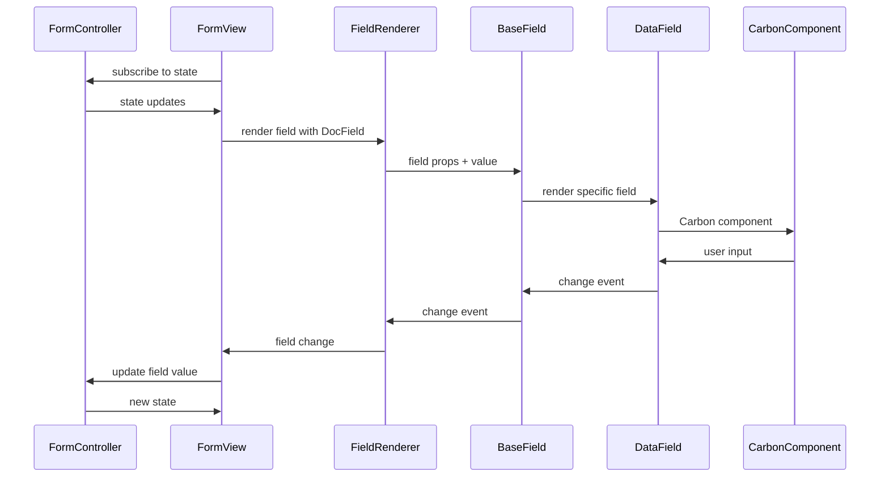
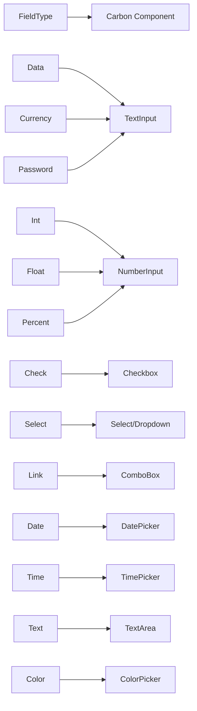
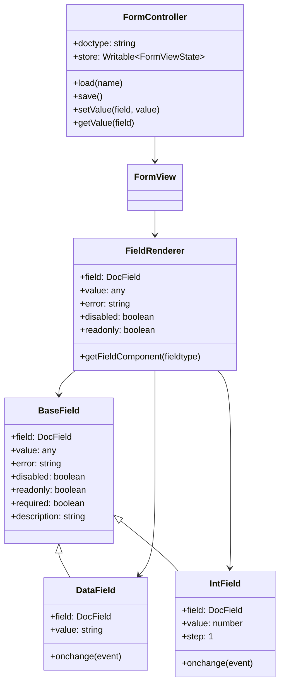
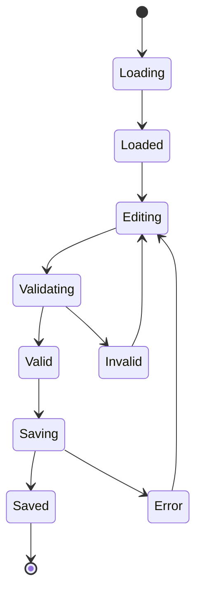

# P3-007 Component Architecture

## Component Hierarchy

```mermaid
graph TD
    A[FormView.svelte] --> B[FieldRenderer.svelte]
    B --> C[BaseField.svelte]
    C --> D[Field Components]
    
    D --> E[Basic Inputs]
    D --> F[Selection Fields]
    D --> G[Link Fields]
    D --> H[Date/Time Fields]
    D --> I[Text Fields]
    D --> J[Rich Content Fields]
    D --> K[File Fields]
    D --> L[Specialized Fields]
    D --> M[Complex Fields]
    
    E --> E1[DataField.svelte]
    E --> E2[IntField.svelte]
    E --> E3[FloatField.svelte]
    E --> E4[CurrencyField.svelte]
    E --> E5[PercentField.svelte]
    
    F --> F1[CheckField.svelte]
    F --> F2[SelectField.svelte]
    
    G --> G1[LinkField.svelte]
    G --> G2[DynamicLinkField.svelte]
    
    H --> H1[DateField.svelte]
    H --> H2[DatetimeField.svelte]
    H --> H3[TimeField.svelte]
    H --> H4[DurationField.svelte]
    
    I --> I1[TextField.svelte]
    I --> I2[SmallTextField.svelte]
    
    J --> J1[TextEditorField.svelte]
    J --> J2[CodeField.svelte]
    J --> J3[HTMLField.svelte]
    J --> J4[MarkdownField.svelte]
    
    K --> K1[AttachField.svelte]
    K --> K2[AttachImageField.svelte]
    
    L --> L1[PasswordField.svelte]
    L --> L2[ColorField.svelte]
    L --> L3[RatingField.svelte]
    L --> L4[SignatureField.svelte]
    L --> L5[GeolocationField.svelte]
    L --> L6[ReadOnlyField.svelte]
    
    M --> M1[TableField.svelte]
```



## Data Flow



## Field Type Mapping



## Component Relationships



## State Management Flow



## Testing Architecture

```mermaid
graph TD
    A[Unit Tests] --> B[Component Tests]
    A --> C[Function Tests]
    B --> D[Rendering Tests]
    B --> E[Event Tests]
    B --> F[Validation Tests]
    C --> G[FieldRenderer Tests]
    C --> H[BaseField Tests]
    
    I[Integration Tests] --> J[FormController Integration]
    I --> K[Field Type Tests]
    I --> L[Workflow Tests]
    
    M[E2E Tests] --> N[Form Submission]
    M --> O[Field Navigation]
    M --> P[Validation Flow]