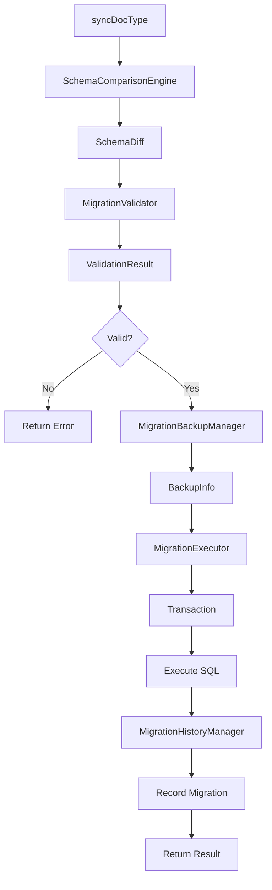
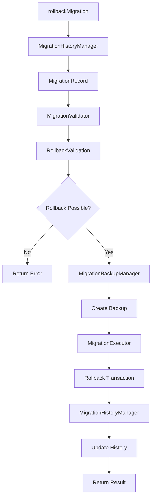
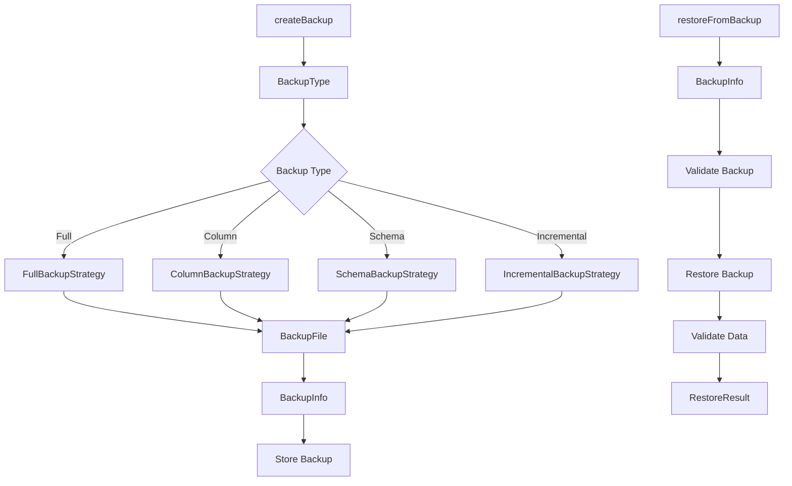

# P2-008 Apply Migrations - Detailed Design

## Type Definitions and Interfaces

### Core Apply Types

```typescript
/**
 * Migration application options
 */
export interface ApplyOptions {
	/** Perform dry run without executing changes */
	dryRun?: boolean;
	
	/** Force migration even if potentially destructive */
	force?: boolean;
	
	/** Preserve data during destructive operations */
	preserveData?: boolean;
	
	/** Create backup before migration */
	backup?: boolean;
	
	/** Continue on error instead of rolling back */
	continueOnError?: boolean;
	
	/** Batch size for large data migrations */
	batchSize?: number;
	
	/** Timeout for migration execution in seconds */
	timeout?: number;
	
	/** Whether to validate data after migration */
	validateData?: boolean;
	
	/** Custom migration context */
	context?: Record<string, any>;
}

/**
 * Synchronization options for DocType migration
 */
export interface SyncOptions extends ApplyOptions {
	/** Whether to sync only specific changes */
	changeTypes?: ('add' | 'remove' | 'modify' | 'index')[];
	
	/** Whether to validate schema before sync */
	validateSchema?: boolean;
	
	/** Whether to check dependencies before sync */
	checkDependencies?: boolean;
}

/**
 * Dry run options
 */
export interface DryRunOptions {
	/** Whether to include SQL statements in result */
	includeSQL?: boolean;
	
	/** Whether to analyze performance impact */
	analyzePerformance?: boolean;
	
	/** Whether to check for data loss risks */
	checkDataLoss?: boolean;
	
	/** Whether to validate rollback possibility */
	validateRollback?: boolean;
}

/**
 * Dry run result
 */
export interface DryRunResult {
	/** Whether migration would be successful */
	success: boolean;
	
	/** SQL statements that would be executed */
	sql: string[];
	
	/** Warnings about potential issues */
	warnings: string[];
	
	/** Errors that would occur */
	errors: string[];
	
	/** Estimated execution time in seconds */
	estimatedTime?: number;
	
	/** Number of rows that would be affected */
	estimatedAffectedRows?: number;
	
	/** Data loss risks identified */
	dataLossRisks: DataLossRisk[];
	
	/** Performance impact analysis */
	performanceImpact?: PerformanceImpact;
}

/**
 * Batch migration result
 */
export interface BatchMigrationResult {
	/** Overall success status */
	success: boolean;
	
	/** Individual migration results */
	results: Map<string, MigrationResult>;
	
	/** Successful migrations */
	successful: string[];
	
	/** Failed migrations */
	failed: string[];
	
	/** Skipped migrations */
	skipped: string[];
	
	/** Total execution time */
	totalTime: number;
	
	/** Combined warnings */
	warnings: string[];
	
	/** Combined errors */
	errors: string[];
}
```

### Migration History Types

```typescript
/**
 * Migration status enumeration
 */
export enum MigrationStatus {
	PENDING = 'pending',
	RUNNING = 'running',
	APPLIED = 'applied',
	FAILED = 'failed',
	ROLLED_BACK = 'rolled_back'
}

/**
 * Applied migration with execution details
 */
export interface AppliedMigration extends Migration {
	/** Actual execution timestamp */
	appliedAt: Date;
	
	/** Execution duration in milliseconds */
	executionTime: number;
	
	/** Number of affected rows */
	affectedRows?: number;
	
	/** Backup path if created */
	backupPath?: string;
	
	/** User who applied the migration */
	appliedBy?: string;
	
	/** Migration status */
	status: MigrationStatus;
	
	/** Error details if failed */
	error?: string;
	
	/** Rollback information */
	rollbackInfo?: RollbackInfo;
	
	/** Execution environment details */
	environment?: ExecutionEnvironment;
}

/**
 * Migration history with statistics
 */
export interface MigrationHistory {
	/** All migrations in chronological order */
	migrations: AppliedMigration[];
	
	/** Last successfully applied migration */
	lastMigration?: AppliedMigration;
	
	/** Migrations that have not been applied yet */
	pendingMigrations: Migration[];
	
	/** Migrations that failed to apply */
	failedMigrations: AppliedMigration[];
	
	/** Migration statistics */
	stats: MigrationStats;
}

/**
 * Rollback information
 */
export interface RollbackInfo {
	/** Rollback migration ID */
	rollbackId: string;
	
	/** Original migration ID */
	originalMigrationId: string;
	
	/** Rollback timestamp */
	rolledBackAt: Date;
	
	/** Rollback execution time */
	executionTime: number;
	
	/** Whether rollback was successful */
	success: boolean;
	
	/** Error details if rollback failed */
	error?: string;
	
	/** User who performed rollback */
	rolledBackBy?: string;
}

/**
 * Execution environment details
 */
export interface ExecutionEnvironment {
	/** Database version */
	databaseVersion: string;
	
	/** SODAF framework version */
	frameworkVersion: string;
	
	/** Node.js version */
	nodeVersion: string;
	
	/** Operating system */
	platform: string;
	
	/** Memory usage at time of execution */
	memoryUsage?: NodeJS.MemoryUsage;
	
	/** Additional environment variables */
	variables?: Record<string, string>;
}
```

### Backup Types

```typescript
/**
 * Backup type enumeration
 */
export enum BackupType {
	FULL = 'full',           // Complete table backup
	COLUMN = 'column',       // Specific column backup
	SCHEMA = 'schema',       // Schema-only backup
	INCREMENTAL = 'incremental' // Incremental backup
}

/**
 * Backup options
 */
export interface BackupOptions {
	/** Default backup type */
	defaultType?: BackupType;
	
	/** Backup storage location */
	storagePath?: string;
	
	/** Compression settings */
	compression?: 'gzip' | 'brotli' | 'none';
	
	/** Retention period in days */
	retentionDays?: number;
	
	/** Whether to encrypt backups */
	encrypt?: boolean;
	
	/** Custom backup naming pattern */
	namingPattern?: string;
	
	/** Whether to verify backup integrity */
	verifyIntegrity?: boolean;
	
	/** Whether to include indexes in backup */
	includeIndexes?: boolean;
	
	/** Whether to include triggers in backup */
	includeTriggers?: boolean;
}

/**
 * Backup information
 */
export interface BackupInfo {
	/** Unique backup identifier */
	id: string;
	
	/** Associated DocType */
	doctype: string;
	
	/** Backup type */
	type: BackupType;
	
	/** Backup creation timestamp */
	createdAt: Date;
	
	/** Backup file path */
	path: string;
	
	/** Backup file size in bytes */
	size: number;
	
	/** Whether backup is compressed */
	compressed: boolean;
	
	/** Whether backup is encrypted */
	encrypted: boolean;
	
	/** Number of records in backup */
	recordCount?: number;
	
	/** Backup checksum for integrity verification */
	checksum: string;
	
	/** Additional metadata */
	metadata?: Record<string, any>;
}

/**
 * Restore result
 */
export interface RestoreResult {
	/** Whether restore was successful */
	success: boolean;
	
	/** Number of records restored */
	recordCount?: number;
	
	/** Restore execution time in milliseconds */
	executionTime: number;
	
	/** Warnings during restore */
	warnings: string[];
	
	/** Errors during restore */
	errors: string[];
	
	/** Whether data was validated after restore */
	validated: boolean;
	
	/** Validation results */
	validation?: ValidationResults;
}
```

### Validation Types

```typescript
/**
 * Validation options
 */
export interface ValidationOptions {
	/** Whether to check for data loss risks */
	checkDataLoss?: boolean;
	
	/** Whether to validate SQL syntax */
	validateSQL?: boolean;
	
	/** Whether to check rollback possibility */
	checkRollback?: boolean;
	
	/** Whether to validate data integrity */
	validateData?: boolean;
	
	/** Whether to check performance impact */
	checkPerformance?: boolean;
	
	/** Custom validation rules */
	customRules?: ValidationRule[];
}

/**
 * Migration validation result
 */
export interface MigrationValidation {
	/** Whether migration is valid */
	valid: boolean;
	
	/** Validation errors */
	errors: ValidationError[];
	
	/** Validation warnings */
	warnings: ValidationWarning[];
	
	/** Recommended actions */
	recommendations: string[];
	
	/** Validation score (0-100) */
	score: number;
	
	/** Validation timestamp */
	validatedAt: Date;
}

/**
 * Schema validation result
 */
export interface SchemaValidation {
	/** Whether schema is valid */
	valid: boolean;
	
	/** Schema errors */
	errors: SchemaError[];
	
	/** Schema warnings */
	warnings: SchemaWarning[];
	
	/** Inconsistencies found */
	inconsistencies: SchemaInconsistency[];
	
	/** Recommended fixes */
	recommendations: SchemaRecommendation[];
}

/**
 * SQL validation result
 */
export interface SQLValidation {
	/** Whether SQL is valid */
	valid: boolean;
	
	/** SQL syntax errors */
	syntaxErrors: SQLSyntaxError[];
	
	/** SQL performance warnings */
	performanceWarnings: SQLPerformanceWarning[];
	
	/** Security issues found */
	securityIssues: SQLSecurityIssue[];
	
	/** SQL optimization suggestions */
	optimizations: SQLOptimization[];
}

/**
 * Rollback validation result
 */
export interface RollbackValidation {
	/** Whether rollback is possible */
	possible: boolean;
	
	/** Rollback blockers */
	blockers: RollbackBlocker[];
	
	/** Rollback risks */
	risks: RollbackRisk[];
	
	/** Rollback recommendations */
	recommendations: RollbackRecommendation[];
	
	/** Estimated rollback difficulty */
	difficulty: 'easy' | 'medium' | 'hard' | 'impossible';
}
```

### Execution Types

```typescript
/**
 * Execution options
 */
export interface ExecutionOptions {
	/** Transaction isolation level */
	isolationLevel?: 'READ_UNCOMMITTED' | 'READ_COMMITTED' | 'REPEATABLE_READ' | 'SERIALIZABLE';
	
	/** Execution timeout in seconds */
	timeout?: number;
	
	/** Whether to create savepoints */
	createSavepoints?: boolean;
	
	/** Savepoint naming pattern */
	savepointPattern?: string;
	
	/** Whether to continue on error */
	continueOnError?: boolean;
	
	/** Maximum retry attempts */
	maxRetries?: number;
	
	/** Retry delay in milliseconds */
	retryDelay?: number;
}

/**
 * Execution result
 */
export interface ExecutionResult {
	/** Whether execution was successful */
	success: boolean;
	
	/** Number of statements executed */
	statementCount: number;
	
	/** Number of affected rows */
	affectedRows?: number;
	
	/** Execution time in milliseconds */
	executionTime: number;
	
	/** Warnings during execution */
	warnings: string[];
	
	/** Errors during execution */
	errors: string[];
	
	/** Results per statement */
	statementResults: StatementResult[];
}

/**
 * Statement execution result
 */
export interface StatementResult {
	/** SQL statement */
	sql: string;
	
	/** Whether statement was successful */
	success: boolean;
	
	/** Number of affected rows */
	affectedRows?: number;
	
	/** Execution time in milliseconds */
	executionTime: number;
	
	/** Error if statement failed */
	error?: string;
	
	/** Statement result data */
	data?: any[];
}

/**
 * Savepoint information
 */
export interface Savepoint {
	/** Savepoint name */
	name: string;
	
	/** Savepoint creation timestamp */
	createdAt: Date;
	
	/** Savepoint state snapshot */
	state?: any;
}
```

### Error and Risk Types

```typescript
/**
 * Data loss risk
 */
export interface DataLossRisk {
	/** Risk identifier */
	id: string;
	
	/** Risk severity */
	severity: 'low' | 'medium' | 'high' | 'critical';
	
	/** Risk description */
	description: string;
	
	/** Affected table or column */
	target: string;
	
	/** Estimated data loss */
	estimatedLoss?: number;
	
	/** Mitigation strategies */
	mitigations: string[];
	
	/** Whether risk is acceptable */
	acceptable: boolean;
}

/**
 * Performance impact analysis
 */
export interface PerformanceImpact {
	/** Overall impact level */
	impact: 'low' | 'medium' | 'high' | 'critical';
	
	/** Estimated execution time increase */
	timeIncrease?: number;
	
	/** Estimated memory usage increase */
	memoryIncrease?: number;
	
	/** Potential locking issues */
	lockingRisks: string[];
	
	/** Optimization suggestions */
	optimizations: string[];
}

/**
 * Validation rule
 */
export interface ValidationRule {
	/** Rule identifier */
	id: string;
	
	/** Rule name */
	name: string;
	
	/** Rule description */
	description: string;
	
	/** Rule severity */
	severity: 'error' | 'warning' | 'info';
	
	/** Rule validation function */
	validate: (migration: Migration) => ValidationResult;
}

/**
 * Validation result
 */
export interface ValidationResult {
	/** Whether validation passed */
	passed: boolean;
	
	/** Validation message */
	message: string;
	
	/** Validation details */
	details?: any;
}
```

## Component Interaction Diagrams

### 1. Migration Application Flow



### 2. Rollback Flow



### 3. Backup and Restore Flow



## Integration with Existing Components

### 1. Schema Comparison Integration

```typescript
class MigrationApplier {
	private schemaEngine: SchemaComparisonEngine;
	
	async syncDocType(doctypeName: string, options?: SyncOptions): Promise<MigrationResult> {
		// Use existing schema comparison to detect changes
		const diff = await this.schemaEngine.compareSchema(doctypeName, {
			caseSensitive: true,
			includeSystemFields: false,
			analyzeDataMigration: true
		});
		
		// Check if migration is needed
		if (!await this.schemaEngine.hasChanges(diff)) {
			return { success: true, warnings: ['No changes detected'] };
		}
		
		// Continue with migration...
	}
}
```

### 2. SQL Generator Integration

```typescript
class MigrationApplier {
	private sqlGenerator: SQLGenerator;
	
	async generateMigrationSQL(diff: SchemaDiff, doctypeName: string): Promise<MigrationSQL> {
		// Use existing SQL generator to create migration statements
		return this.sqlGenerator.generateMigrationSQL(diff, doctypeName);
	}
	
	async generateRollbackSQL(migration: Migration): Promise<string[]> {
		// Use existing rollback generator
		const statements = this.sqlGenerator.generateRollbackSQL(migration.sql);
		return statements.map(stmt => stmt.sql);
	}
}
```

### 3. Database Integration

```typescript
class MigrationExecutor {
	private database: Database;
	
	async executeInTransaction<T>(
		operations: () => Promise<T>,
		options?: TransactionOptions
	): Promise<T> {
		// Use existing database transaction support
		return await this.database.withTransaction(async (transaction) => {
			return await operations();
		}, options);
	}
	
	async getTableInfo(doctypeName: string): Promise<TableInfo> {
		// Use existing database schema introspection
		return await this.database.get_table_info(doctypeName);
	}
}
```

## Security Considerations

### 1. SQL Injection Prevention

All SQL statements must use parameterized queries:

```typescript
class MigrationExecutor {
	async executeParameterized(sql: string, params: any[]): Promise<ExecutionResult> {
		// Use database's parameterized query support
		return await this.database.sql(sql, params);
	}
}
```

### 2. Access Control

Implement role-based access for migration operations:

```typescript
interface MigrationPermissions {
	/** Can apply migrations */
	canApply: boolean;
	
	/** Can rollback migrations */
	canRollback: boolean;
	
	/** Can create backups */
	canBackup: boolean;
	
	/** Can view migration history */
	canViewHistory: boolean;
	
	/** Allowed DocTypes */
	allowedDocTypes: string[];
}
```

### 3. Audit Trail

Log all migration activities with user context:

```typescript
interface AuditLog {
	/** Action performed */
	action: string;
	
	/** User who performed action */
	user: string;
	
	/** Timestamp */
	timestamp: Date;
	
	/** Migration ID */
	migrationId?: string;
	
	/** DocType affected */
	doctype?: string;
	
	/** Additional context */
	context?: Record<string, any>;
}
```

## Performance Optimizations

### 1. Batch Processing

Process large migrations in batches to avoid memory issues:

```typescript
class BatchProcessor {
	async processInBatches<T, R>(
		items: T[],
		batchSize: number,
		processor: (batch: T[]) => Promise<R[]>
	): Promise<R[]> {
		const results: R[] = [];
		
		for (let i = 0; i < items.length; i += batchSize) {
			const batch = items.slice(i, i + batchSize);
			const batchResults = await processor(batch);
			results.push(...batchResults);
		}
		
		return results;
	}
}
```

### 2. Index Management

Temporarily disable indexes during bulk operations:

```typescript
class IndexManager {
	async disableIndexes(tableName: string): Promise<void> {
		await this.database.run(`PRAGMA index_list(${tableName})`);
		// Drop indexes temporarily
	}
	
	async enableIndexes(tableName: string, indexes: IndexInfo[]): Promise<void> {
		// Recreate indexes
		for (const index of indexes) {
			await this.database.create_index(
				index.name,
				tableName,
				index.columns,
				index.unique
			);
		}
	}
}
```

### 3. Connection Pooling

Use connection pooling for concurrent operations:

```typescript
class ConnectionPoolManager {
	private pools: Map<string, any> = [];
	
	async getConnection(doctypeName: string): Promise<any> {
		if (!this.pools.has(doctypeName)) {
			this.pools.set(doctypeName, this.createPool(doctypeName));
		}
		return this.pools.get(doctypeName);
	}
	
	private createPool(doctypeName: string): any {
		// Create connection pool for specific DocType
	}
}